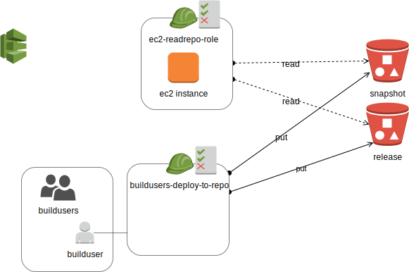

# ansible aws

## Pre-Requisites

 * AWS account - your Aws access key id, secret (Set up as env variables)
 * Ansible installed on the environment - tested at v2.7+ on MacOS


## Deployment overview



### Initial VPC and Networking

[Infrastructure Instructions](infra/README.md)

### Devops

[DevOps instructions](devops/README.md)


## Vagrant

ssh vagrant@127.0.0.1 -p 2222 -i $(pwd)/playbooks/.vagrant/machines/default/virtualbox/private_key

## Pre-Requisites

 * AWS Account and access keys for API's
 * [Ansible installed](https://docs.ansible.com/ansible/latest/installation_guide/intro_installation.html#intro-installation-guide)

## Deploying via Travis-CI

https://blog.travis-ci.com/2017-11-30-testing-ansible-roles-using-docker-on-travis

https://tasdikrahman.me/2017/04/06/Testing-your-ansible-roles-using-travis-CI/

## Build EC2 images for deployments

https://medium.com/devopslinks/build-your-own-ec2-machine-images-with-packer-ansible-on-aws-for-immutable-aws-deployments-f7dbe81934a1

### Pre-Requisites

Encrypt your AWS Access keys in the travis-ci deployment  

### References

https://github.com/ansistrano/deploy/blob/master/.travis.yml

https://blog.travis-ci.com/2017-11-30-testing-ansible-roles-using-docker-on-travis

http://dev.solita.fi/2017/04/12/easy-test-deployments.html


## Build server

AWS with travis-ci

https://medium.com/@itsdavidthai/comprehensive-aws-ec2-deployment-with-travisci-guide-7cafa9c754fc


## Where to get re-usable roles

Ansible galaxy - https://galaxy.ansible.com/

https://valdhaus.co/books/taste-test-puppet-chef-salt-stack-ansible.html

An approach to test anisble roles with Travis-ci:
https://www.jeffgeerling.com/blog/testing-ansible-roles-travis-ci-github

## Structure

```
production                # inventory file for production servers
staging                   # inventory file for staging environment

group_vars/
   group1                 # here we assign variables to particular groups
   group2                 # ""
host_vars/
   hostname1              # if systems need specific variables, put them here
   hostname2              # ""

library/                  # if any custom modules, put them here (optional)
module_utils/             # if any custom module_utils to support modules, put them here (optional)
filter_plugins/           # if any custom filter plugins, put them here (optional)

site.yml                  # master playbook
security.yml            # playbook for security/idam tier
infra.yml               # playbook for infrastructure tier

roles/
    common/               # this hierarchy represents a "role"
        tasks/            #
            main.yml      #  <-- tasks file can include smaller files if warranted
        handlers/         #
            main.yml      #  <-- handlers file
        templates/        #  <-- files for use with the template resource
            ntp.conf.j2   #  <------- templates end in .j2
        files/            #
            bar.txt       #  <-- files for use with the copy resource
            foo.sh        #  <-- script files for use with the script resource
        vars/             #
            main.yml      #  <-- variables associated with this role
        defaults/         #
            main.yml      #  <-- default lower priority variables for this role
        meta/             #
            main.yml      #  <-- role dependencies
        library/          # roles can also include custom modules
        module_utils/     # roles can also include custom module_utils
        lookup_plugins/   # or other types of plugins, like lookup in this case

    webtier/              # same kind of structure as "common" was above, done for the webtier role
    monitoring/           # ""
    fooapp/               # ""
  ```

## References

[Ansible - best practices (Folder structure)](https://docs.ansible.com/ansible/latest/user_guide/playbooks_best_practices.html)

[Ansible - Up and Running](https://www.safaribooksonline.com/library/view/ansible-up-and/9781491979792/)

http://docs.ansible.com/ansible/latest/guide_aws.html#provisioning

[Ansible external inventory for AWS](https://docs.ansible.com/ansible/latest/user_guide/intro_dynamic_inventory.html#example-aws-ec2-external-inventory-script)

[Ansible cloud modules](https://docs.ansible.com/ansible/latest/modules/list_of_cloud_modules.html)

[Ansible EC2 create an image](https://www.agix.com.au/build-an-ec2-using-ansible-step-by-step/)
