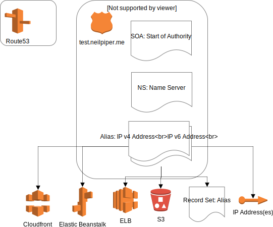

# Domain routing

## Domains
 * neilpiper.me
 * dev.neilpiper.me
 * test.neilpiper.me

## What is AWS Route 53

Amazon Route 53 provides highly available and scalable Domain Name System (DNS), domain name registration, and health-checking web services.

## What is Route53 used for here?

 * Create and manage public DNS records
 * REST API to create, update, manage DNS records

# Scenario

Routing to the established zones `dev.neilpiper.me` and `test.neilpiper.me` routes through establishing Route53 records, via a VPC based Internet gateway to exposed instances such as EC2, ELB's or S3 buckets.


## test.neilpiper.me



```
- name: create a public zone
  route53_zone:
    zone: test.neilpiper.me
    comment: test domain
```

## Sub-Components

Hosted zone
 4 Route 53 name servers - HA 'NS'
 State of Authority record 'SOA'

### Start of Authority Record (SOA)

SOA record Identifies the base DNS information about the domain. Each zone contains a single SOA record.

Time to live - The amount of time, in seconds, that you want DNS recursive resolvers to cache information about this record.

Defaults to:
 * 900 seconds Time to live

```
Format:
    [authority-domain] [domain-of-zone-admin]
    [zone-serial-number] [refresh-time] [retry-time]
    [expire-time] [negative caching TTL]
```

### Name Server

Name Server (NS) records are used by Top Level Domain servers (TLD's) to direct traffic to the DNS server that contains the authoritative DNS records.

Amazon populates these with defaults of a list of DNS servers on creation


### A - IP V4 Address / AAAA - IP V6 Address

Aliased or non aliased records to link an amazon IP address to the Top level domain / Hosted zone.

 * alias-target --> website
 * Options:
   - Cloud front
   - Elastic beanstalk env Name
   - ELB CNAME
   - s3 website endpoint
   - Resource record set in this hosted zone

```
- route53:
      state: present
      zone: neilpiper.me
      record: test.neilpiper.me
      type: A
      ttl: 7200
      value: 1.1.1.1,2.2.2.2,3.3.3.3
      wait: yes
```


# References

https://docs.aws.amazon.com/Route53/latest/DeveloperGuide/resource-record-sets-values-basic.html#rrsets-values-basic-ttl
