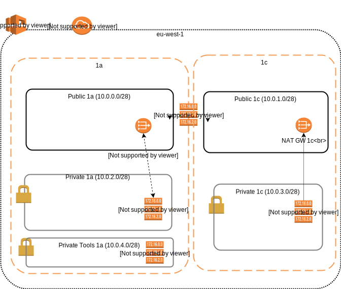
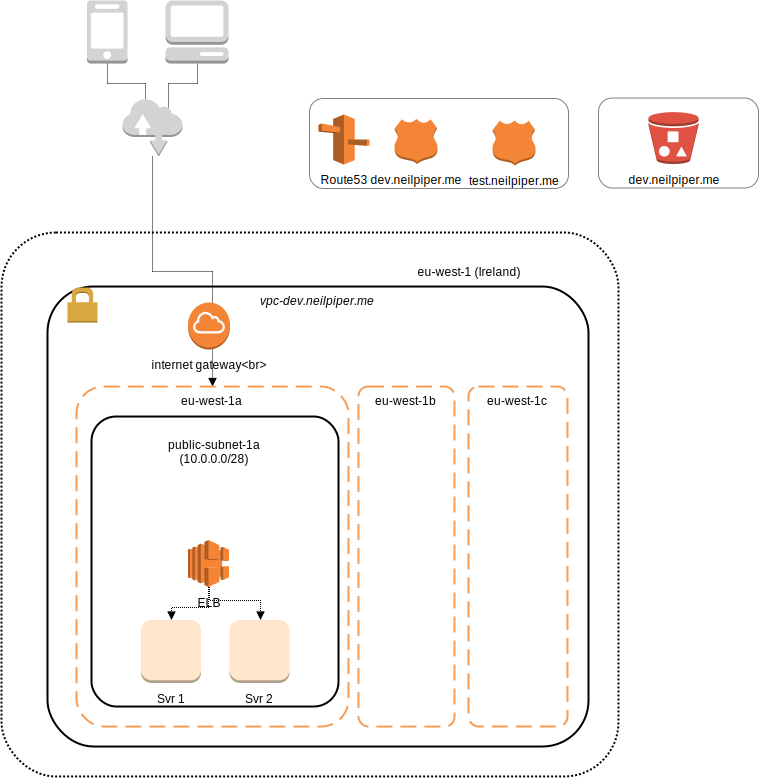

# Infra playbook

## Pre-Reqs

An EC2 User with high level admin rights.

Set environment Variables:

```
export AWS_ACCESS_KEY_ID={KEY_ID}
export AWS_SECRET_ACCESS_KEY={SECRET}
```

The default region is `eu-west-1` (Ireland).  This value can be overwritten in variables.

### Software

 * Ansible 2.4+
 * SSH

## Diagram




## Order of Construction

- AWS Region (Config)
 - [VPC]()
 - [Internet Gateway](http://docs.ansible.com/ansible/latest/ec2_vpc_igw_module.html)
 - Public [Route Table](http://docs.ansible.com/ansible/latest/ec2_vpc_route_table_module.html) 1 (Internet GW)
 - Public [Security group](http://docs.ansible.com/ansible/latest/ec2_group_module.html) (SSH)
   - Availability Zone 1A
     - [Public Subnet AZ1A](http://docs.ansible.com/ansible/latest/ec2_vpc_subnet_module.html)
       - [NAT Gateway 1A](http://docs.ansible.com/ansible/latest/ec2_vpc_nat_gateway_module.html)
         - [Elastic IP](http://docs.ansible.com/ansible/latest/ec2_eip_module.html)
   - Availability Zone 1C
     - [Public Subnet AZ1C](http://docs.ansible.com/ansible/latest/ec2_vpc_subnet_module.html)
       - [NAT Gateway 1C](http://docs.ansible.com/ansible/latest/ec2_vpc_nat_gateway_module.html)
         - [Elastic IP](http://docs.ansible.com/ansible/latest/ec2_eip_module.html)

     - _Private Subnet AZ1_
       - Private Route Table (NAT)
       - Private Security Group (t.b.c)


## RUNNING

### Check syntax

Perform a syntax check on the playbook, but do not execute it
```
ansible-playbook --syntax-check ../testing infra.yml
```

### Dry run
don't make any changes; instead, try to predict some of the changes that may occur

```
ansible-playbook --check -i ../testing infra.yml
```


### Run in verbose Mode

This command creates the VPC, Private, Tools and Public Subnets, Route tables, NAT Gateways and an Internet Gateway

```
ansible-playbook -vvv -i ../testing infra.yml
```

### Tear Down

This command tears down the vpc

```
ansible-playbook -vvv -i ../testing infra_teardown.yml
```
## DNS and Network Routing (Route 53)

  _TO DO - this is to be added_




## References

[Ansible - ec2 Provisioning](http://docs.ansible.com/ansible/latest/guide_aws.html#provisioning)


[LinuxSchool - Build and manage EC2 images with ansible](https://www.linuxschoolonline.com/use-ansible-to-build-and-manage-aws-ec2-instances/)

[AWS Ansible dynamic IP](https://aws.amazon.com/blogs/apn/getting-started-with-ansible-and-dynamic-amazon-ec2-inventory-management/)

### Ansible commands

* [Create VPC: ec2_vpc_net](https://docs.ansible.com/ansible/latest/modules/ec2_vpc_net_module.html)
* [Create Internet Gateway: ec2_vpc_igw](http://docs.ansible.com/ansible/latest/ec2_vpc_igw_module.html)
* [Create Route Table: ec2_vpc_route_table](http://docs.ansible.com/ansible/latest/ec2_vpc_route_table_module.html)
* [Create Sec Group: ec2_group](http://docs.ansible.com/ansible/latest/ec2_group_module.html)
* [Create Subnet: ec2_vpc_subnet](http://docs.ansible.com/ansible/latest/ec2_vpc_subnet_module.html)
* [Create NAT Gateway: ec2_vpc_nat_gateway](http://docs.ansible.com/ansible/latest/ec2_vpc_subnet_module.html)
