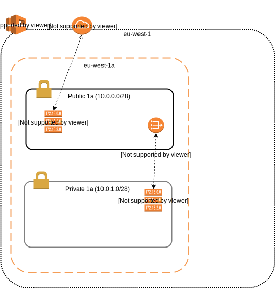

# Infra playbook

## Pre-Reqs

An EC2 User with high level admin rights.

Set environment Variables:

```
export AWS_ACCESS_KEY_ID={KEY_ID}
export AWS_SECRET_ACCESS_KEY={SECRET}
```

The default region is `eu-west-1` (Ireland).  This value can be overwritten in variables.

### Software

 * Ansible 2.4+
 * SSH

## Diagram



## Order of Construction

- AWS Region (Config)
 - [VPC]()
 - [Internet Gateway](http://docs.ansible.com/ansible/latest/ec2_vpc_igw_module.html)
 - Public [Routen
  Table](http://docs.ansible.com/ansible/latest/ec2_vpc_route_table_module.html) 1 (Internet GW)
 - Public [Security group](http://docs.ansible.com/ansible/latest/ec2_group_module.html) (SSH)
   - Availability Zone
     - [Public Subnet AZ1](http://docs.ansible.com/ansible/latest/ec2_vpc_subnet_module.html)
       - [NAT Gateway](http://docs.ansible.com/ansible/latest/ec2_vpc_nat_gateway_module.html)
         - [Elastic IP](http://docs.ansible.com/ansible/latest/ec2_eip_module.html)

     - _Private Subnet AZ1_
       - Private Route Table (NAT)
       - Private Security Group (t.b.c)

## DNS and Network Routing (Route 53)


## RUNNING

### Check syntax

Perform a syntax check on the playbook, but do not execute it
```
ansible-playbook --syntax-check ../testing infra.yml
```

### Dry run
don't make any changes; instead, try to predict some of the changes that may occur

```
ansible-playbook --check -i ../testing infra.yml
```


### Run in verbose Mode
```
ansible-playbook -vvv -i ../testing infra.yml
```

## References

http://docs.ansible.com/ansible/latest/guide_aws.html#provisioning

http://jeremievallee.com/2016/07/27/aws-vpc-ansible/

https://www.linuxschoolonline.com/use-ansible-to-build-and-manage-aws-ec2-instances/
