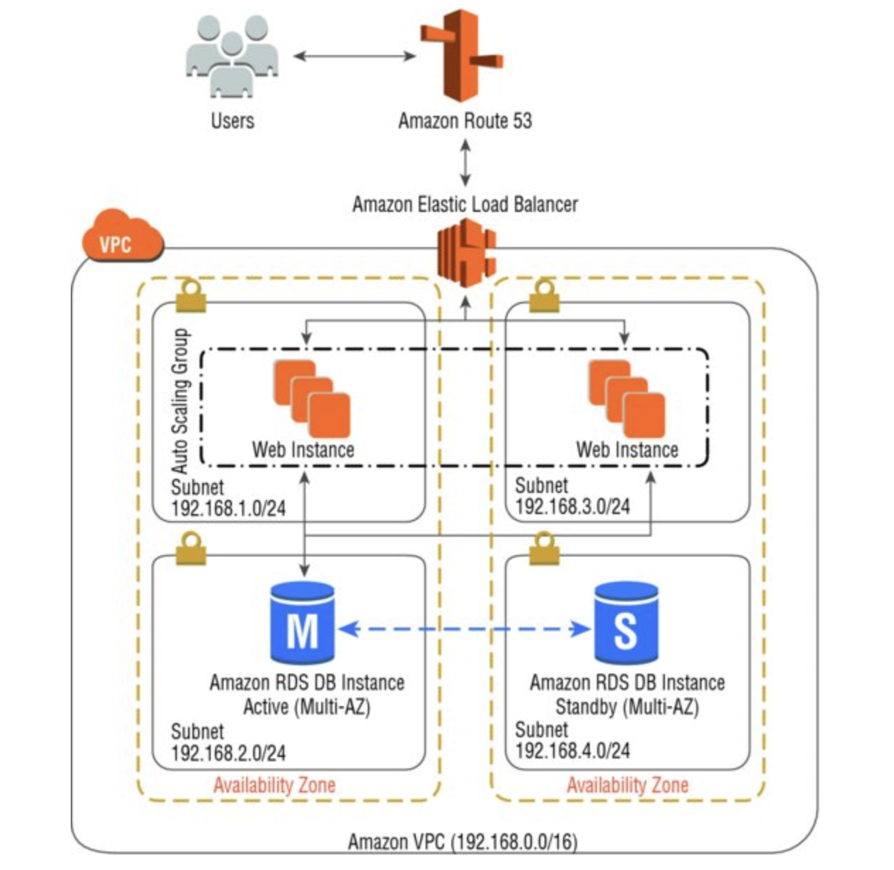

# AWS Certification role


## Chapter 14 exercise

Implement a resilient application leveraging some of the best practices outlined in the AWS Certification principles.



## Inventory

 * VPC aligned to domain neilpiper.me - 2 AZ's
 * 2 Public subnets
 * 2 Private (DB) subnets
 * Auto-scaling group (Web server)
 * Elastic load balancer
 * Route 53 alias record to ELB
 * EC2 Web server instances
 * Internet Gateway
 * NAT Gateway
 * RDS MySQL Database - Read replica
 * Security groups per layer (ELB, Web, DB)
 * Route tables (NACL's) - Private/Public subnets


## Pre-Reqs

 An EC2 User with high level admin rights.

 Set environment Variables:

 ```
 export AWS_ACCESS_KEY_ID={KEY_ID}
 export AWS_SECRET_ACCESS_KEY={SECRET}
 ```

 The default region is `eu-west-1` (Ireland).  This value can be overwritten in variables. ( `defaults/main.yml` )

### Software

* Ansible 2.4+
* SSH

## RUNNING

### Check syntax

Perform a syntax check on the playbook, but do not execute it
```
ansible-playbook --syntax-check -i ./defaults/defaults ./tasks/main.yml
```

### Dry run
don't make any changes; instead, try to predict some of the changes that may occur

```
ansible-playbook --check -i ./defaults/defaults ./tasks/main.yml
```


### Run in verbose Mode
```
ansible-playbook -vvv -i ../defaults/main.yml ./tasks/main.yml
```

## References

http://docs.ansible.com/ansible/latest/guide_aws.html#provisioning
