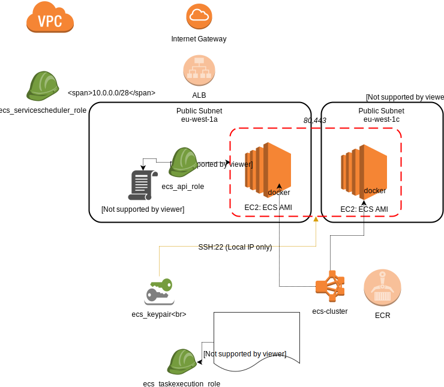

# Amazon ECS / ecr

Setting up
https://docs.aws.amazon.com/AmazonECS/latest/developerguide/get-set-up-for-amazon-ecs.html

* vpc
* Public subnet(s)
* Internet Gateway
* Key Pair

## Create an IAM Role for your Container Instances and Services

Ansible IAM Roles
https://docs.ansible.com/ansible/2.5/modules/iam_role_module.html

'ecsInstanceRole' -  Amazon ECS Container Instance IAM Role
defaults/AmazoneEC2ContainerServiceForEC2Role.policy

'ecsServiceRole'
defaults/AmazoneEC2ContainerServiceRole.policy

## Create a Key Pair

ec2_key module

https://docs.aws.amazon.com/AmazonECS/latest/developerguide/get-set-up-for-amazon-ecs.html#create-a-key-pair

The private key file is automatically downloaded by your browser. The base file name is the name you specified as the name of your key pair, and the file name extension is .pem. Save the private key file in a safe place.

This is the only chance for you to save the private key file. You'll need to provide the name of your key pair when you launch an instance and the corresponding private key each time you connect to the instance.

Suggestion: Store in a secure s3 location

## Create a Security Group

ecs-instances-default-cluster (Regions)

Consider HTTP, HTTPS, SSH ports

HTTP : anywhere (0.0.0.0)
HTTPS : anywhere (0.0.0.0)
SSH:

connect to your container instance from your IP address using SSH

rules that allow inbound and outbound HTTP and HTTPS access from anywhere

https://docs.aws.amazon.com/AmazonECS/latest/developerguide/get-set-up-for-amazon-ecs.html#create-a-base-security-group

## CLI

https://docs.aws.amazon.com/AmazonECS/latest/developerguide/ECS_AWSCLI_EC2.html#AWSCLI_EC2_create_cluster

### Step 1: (Optional) Create a Cluster

https://docs.ansible.com/ansible/2.5/modules/ecs_cluster_module.html

### Step 2:  Launch ECS Container instances
https://docs.aws.amazon.com/AmazonECS/latest/developerguide/launch_container_instance.html

Inputs:
 * Number of instances
 * Network - vpc
 * Subnet (AZ)
 * Auto-assign Public IP (true)
 * role = ecsInstanceRole
 * Config
   - Storage
 * SecurityGroup

AMI:
eu-west-1	ami-c91624b0

https://docs.aws.amazon.com/AmazonECS/latest/developerguide/ecs-agent-config.html

### Step 5: Register a Task Definition

Task definitions are lists of containers grouped together, they are given a 'family' name

https://docs.ansible.com/ansible/2.5/modules/ecs_taskdefinition_module.html

### Step 7: Run a Task
After you have registered a task for your account and have launched a container instance that is registered to your cluster `run-task`

https://docs.ansible.com/ansible/2.5/modules/ecs_task_module.html

## Role guide_aws

https://docs.aws.amazon.com/AmazonECS/latest/developerguide/instance_IAM_role.html

https://docs.aws.amazon.com/AmazonECS/latest/developerguide/service_IAM_role.html

https://docs.aws.amazon.com/AmazonECS/latest/developerguide/ECS_CLI_tutorial_EC2.html

https://github.com/awslabs/ecs-refarch-continuous-deployment

https://github.com/aws-samples/aws-cicd-docker-containers
