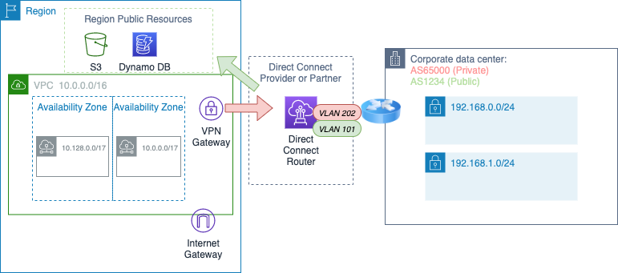

# AWS Advanced Networking Exam


* Design and implement AWS networks (29%)
* Hybrid IT network archs (23%)
* Configure network integration with application services (15%)
* Design and implement for security and compliance (12%)
* Automate AWS tasks (8%)
* Manage, optimise and troubleshoot the network (12%)

## Chapter 1 - Introduction to Advanced Networking

Regions, Availability Zones, edge locations, and customer cross-connect facilities

When you use services that are delivered directly on the Internet, such as edge locations and public service endpoints, you control network behaviors using service-specific mechanisms like policies and whitelists


### How Packet exchange works in a VPC

When an Amazon EC2 instance, say Instance A, in your VPC initiates communication with another Amazon EC2 instance, say Instance B, over IPv4, Instance A will broadcast an Address Resolution Protocol (ARP) packet to obtain the Instance B’s Media Access Control (MAC) address. The ARP packet leaving Instance A is intercepted by the server Hypervisor. The Hypervisor queries the mapping service to identify whether Instance B exists in the VPC and, if so, obtains its MAC address. The Hypervisor returns a synthetic ARP response to Instance A containing Instance B’s MAC address.

Instance A is now ready to send an IP packet to Instance B. The IP packet has Instance A’s source IP and Instance B’s destination IP. The IP packet is encapsulated in an Ethernet header with Instance A’s MAC as the source address and Instance B’s MAC as the destination address. The Ethernet packet is then transmitted from Instance A’s network interface.

### Direct Connect

Using industry standard 802.1q VLANs

This dedicated connection can be partitioned into multiple virtual interfaces. This allows you to use the same connection to access public resources such as objects stored in Amazon S3 using public IP address space, and private resources such as Amazon EC2 instances running within an Amazon Virtual Private Cloud (VPC) using a private IP space, while maintaining network separation between the public and private environments.

All data transferred over your dedicated connection is charged at the reduced AWS Direct Connect data transfer rate rather than Internet data transfer rates.

Provides 1 Gbps and 10 Gbps connections


## What runs in an Edge location?

 * Amazon Cloudfront with Amazon S3
 * AWS Lambda@Edge
 * Route53
 * Web firewall
 * Shield (Anti-DDOS)

116 Edge locations, Regional Edge caches

**Why?**
 * Improved latency, less packet loss & overall quality
 * Avoids conflict with network interconnect capacity
 * Greater Ops control

### Goals

 * Global Infrastructure, Regions, AZ's
 * Amazon VPC
 * How Cloud Service Integration works


# Chapter 2 - VPC, Networking fundamentals

A VPC IPv4 address range may be as large as **/16** (65,536 addresses) or as small as **/28** (16 addresses)
CIDR block is required.

Amazon EC2 features like instance metadata and the Amazon DNS Server require the use of IPv4

Private IP addresses are IPv4 addresses assigned from the CIDR block of your VPC

VPC subnets have a modifiable attribute that determines whether elastic network interfaces created in the subnet will automatically receive public IPv4 addresses

Should not overlap

Max of 6 CIDR ranges per VPC

/16 (65536), /28 minimum (16 IP addresses)
32 - '/X' byte count ( ^2)

## IP V6

(Optional) IPv6 address range is a fixed size of /56 (4,722,366,482,869,645,213,696 addresses) and is assigned to your VPC from Amazon’s own IPv6 allocation.
IPv6 addresses are public.

But.. number of IP6 addresses is constrained by pool of available IP4 addresses in the VPC.

VPC can operate in dual-stack mode. IPv4 and IPv6 operate independently. You will need to configure the routing and security components of your VPC for each address family

Similar to IPv4, you can configure an attribute on your subnet to assign an IPv6 address automatically to new elastic network interfaces created in a given subnet.

Associate a fixed-size /64 IPv6 CIDR block to each subnet that requires IPv6


### Link Local addresses

LLAs are addresses from the reserved fe80::/10 IPv6 CIDR block. The LLA is a required “on-link” address used for a variety of IPv6 processes, including DHCPv6 and Neighbor Discovery Protocol

Amazon VPC expects the LLA of a given interface to conform with the modified **EUI-64** format in which the **48-bit MAC address of the elastic network interface** is converted into a 64-bit interface ID

### GUA addresses

'Global Unicast Address'

To communicate with the Internet over IPv6, your instance must use an Amazon GUA

Amazon maintains large IPv6 GUA allocations from Regional Internet Registries (RIRs)

## CIDR blocks per subnet

5 reserved IP addresses in a subnet ( .0, .1, .2, .3, .255)

Route table is interpreted by the Router (.1) - expressed as CIDR blocks or VPC Gateway endpoints, or ENI's.

 * .0 Network address (of Subnet?)
 * .1 Router of the subnet itself
 * .2 DNS IP Address for Subnet (DNS Resolver)
 * .3 AWS Reserved
 * .255 Broadcast address (Reserved)

## Elastic IP addresses

Allocation of an Elastic IP address within (specific to) a region

[Amazon IP Ranges per region](https://ip-ranges.amazonaws.com/ip-ranges.json)

Public IP addresses are assigned from a pool of routable IPv4 addresses administered by Amazon

## Security Groups

Up to 500 security groups for each VPC.

You can add up to 50 inbound and 50 outbound rules to each security group

Associate up to five security groups with each network interface.

Allow rules, but not deny rules. Implicit deny

## NACL

Stateless firewall for the subnet
Ordered list of numbered rules on traffic in/out of subnet. Usually it is addition of Deny rules

Not stateful - needs explicit inbound, outbound including ephemeral outbound ports. Return traffic must be explicitly allowed by rules as default is all traffic IN, OUT for NACL's.

Every subnet must be associated with a network ACL

Ephemeral ports:  1025 to 65535
Outbound NACL rule usually allow all 0.0.0.0/0:*

## Internet Gateway

Internet gateway maintains the one-to-one mapping of the instance’s private IPv4 address and public IPv4 address

Amazon EC2 instances within a VPC are aware of their public IPv6 addresses (AWS GUA Allocated). When traffic is sent from the instance to the Internet, the Internet gateway forwards the instance’s source IPv6 address unchanged

**You must do the following to create a public subnet with Internet access:**

```
Create and attach an Internet gateway to your VPC.
Create a route in the associated subnet route table to send non-local traffic (0.0.0.0/0 for IPv4 or ::/0 for IPv6) to the Internet gateway.
Configure your network ACLs and security group rules to allow relevant traffic to flow to and from your instance.
```

**You must do the following to enable an Amazon EC2 instance to send and receive traffic from the Internet:**

``
Assign a public IPv4 or Elastic IP address.
Assign an IPv6 GUA.
``

## NAT Gateways, Instances

NAT gateway provides better availability, provides higher bandwidth, and requires less administrative effort than NAT instances

NAT is not supported for IPv6, To create a private IPv6 subnet, see the section on the egress-only Internet gateway

## Virtual Private Gateways (VGWs), Customer Gateways, and Virtual Private Networks (VPNs)

Connect an existing data center to your VPC using either hardware or software VPN connections. Both options make the VPC an extension of your data center

virtual private gateway (VGW) is a logical construct in your VPC that provides edge routing for AWS managed VPN connections and AWS Direct Connect

Customer gateway represents the physical device or software application on the remote end of the VPN connection. The customer gateway must have a static IPv4 address

Once the VGW and the customer gateway have been created, the last step is to create a VPN connection.

A single VPN connection consists of two Internet Protocol Security (IPsec) tunnels for high availability to the VPC.

VPN Connection can have either static, or dynamic routing (BGP supported)

If you will be using static routing, you must enter the routes for your network that should be communicated to the VGW

## VPC Endpoints

two types of VPC endpoints: interface and gateway

Avoids sharing / throttling of NAT gateway, Internet Gateway (5 GBps)

VPC endpoints are supported for IPv4 traffic only

Interface endpoints (powered by AWS PrivateLink) use an elastic network interface in your VPC with a private IP address that serves as an entry point for traffic destined to a supported service

Interface endpoints support Amazon Kinesis Streams, Elastic Load Balancing API, Amazon EC2 API, Amazon EC2 Systems Manager (SSM), AWS Service Catalog, Endpoint services hosted by other accounts, and supported Marketplace partner services

Gateway endpoints use a route table target for a specified route in your route table for supported services. Gateway endpoints currently support communication with Amazon Simple Storage Service (Amazon S3) and Amazon DynamoDB

Endpoints allow resources in your VPC to use their private IPv4 addresses to communicate with resources outside of their VPC.

You cannot access a VPC endpoint from across an AWS managed VPN connection or a VPC peering connection. (Workaround - Modify DNS and use a proxy fleet to reach VPC endpoints)

### Creating a VPC Endpoint (Gateway)

```
Specify the VPC.
Specify the service. -- com.amazonaws.<region>.<service>.
Specify the policy. You can allow full access or create a custom policy. This policy can be changed at any time.
Specify the route tables. A route will be added to each specified route table, which will state the service prefix list as the destination and the endpoint as the target.
```

Using a VPC endpoint, your Amazon S3 bucket policy can allow access based on a VPC identifier or on a specific VPC endpoint identifier. (Don't use IP address)

`aws:sourceVpce: vpcendpoint_ID`

## VPC Peering

an create a VPC peering connection between your own VPCs or with a VPC in another AWS account
VPC peering is supported in the same region or to another region within the same Amazon partition

Peering connections are created through a request/accept protocol

Once a VPC peer is established, both sides of the peer must add routes for the respective peer.  You can also use partial prefixes in the route table for peering (when whole range is not needed )

If a peer is established within the same region, you can reference security groups in the peer VPC, enable DNS hostname resolution for the peer VPC.

Peers within the same region may enable hostname resolution to receive private IPv4 addresses for peer instances.

Amazon encrypts traffic between peers in different regions.

You cannot have more than one peering connection between the same two VPCs at the same time

For certain applications (for example, web services), it may be more beneficial to use VPC endpoints

Jumbo frames are supported only between peers in the same region.

IPv6 is supported only between peers in the same region

### What is a Partition?

The first element of an ARN is the partition. Partitions allow Amazon to group regions with common, but distinct, operational requirements into isolated administrative domains.

(aws, aws-cn, aws-us-gov)

## Placement groups

logical groupings of instances within a single Availability Zone

low-latency, high packet-per-second performance, and high network throughput. Placement groups are appropriate for workloads like High Performance Computing (HPC) when internode network performance is important. (Use instances with enhanced networking)

a placement group causes instances to colocate in a section of the Amazon infrastructure. Recommended you explicitly set number of instances required.

 * Confined to single AZ
 * Slowest instance is determinant of network throughput
 * Network traffic outside placement group, is 25Gbps for EC2, S3 & 5Gbps for other traffic
 * Support both IPv4, IPv6

 ## Elastic Network Interfaces

 Virtual network interface you can attach to an instance in a VPC, only available within a VPC and are associted with a subnet upon creation.

 Has a primary IPv4 private address, mac address and at least one security group. You cannot detach the primary network interface.

 An elastic network interface is confined to a single Availability Zone

 It can also have a secondary private IP, one or more Elastic IP addresses, one public IPv4 address and one or more IPv6 addresses.

 An ENI Can attach to a replacement EC2 Instance, and more than 1 ENI can be attached to an EC2 instance.

Multiple elastic network interfaces allow you to use network and security appliances in your VPC, create dual-homed instances with workloads/roles on distinct subnets, or create a low-budget, high-availability solution.

The maximum number of elastic network interfaces per instance and the number of IPv4 or IPv6 addresses supported on the elastic network interface vary based on the Amazon EC2 instance type.

Elastic network interfaces can be attached to an instance while running (hot attach), when stopped (warm attach), or at launch (cold attach)

ENI used to communicate to EBS (Elastic block store)

## DHCP Option sets

A standard for passing configuration information to hosts on an IP network.

The Domain Name Service provides a standard mechanism to resolve a hostname to an IP address. Amazon VPC attribute `enableDnsSupport` determines whether or not the Amazon DNS server is enabled for your VPC

Amazon DNS integrates with Amazon Route 53 and AWS Directory Service. When two VPCs within the same region are peered, you can enable DNS resolution for Amazon EC2 instances across the peering

Each VPC must have exactly one DHCP option set assigned to it.

Parameters:
 * Domain Name Servers (DNS)
 * Domain name
 * NTP-Servers
 * netbios name Servers
 * netbios node type


## VPC Flow Logs

Feature of Amazon VPC that captures IP traffic flow information in your VPC

VPC Flow Logs can be enabled at the VPC, subnet, or network interface level. The logs are published approximately every 10 minutes - useful for a number of reasons, including anomaly detection and troubleshooting

## 'JumboFrames'

Standard - 1522 bytes (Overhead for 'envelope' is higher)

Jumbo Frames 9001 MTU - smaller overhead, but.. all devices must support the 9001 MTU ( Internet)
Within a VPC
Not well supported outside a VPC, VPN, Internet

# Chapter 3 - Advanced Amazon Virtual Private Cloud

## VPC Endpoints

A VPC endpoint lets you privately connect your VPC to an AWS Cloud service without requiring an Internet gateway, a Network Address Translation (NAT) device, a VPN connection, or AWS Direct Connect.

VPC endpoints allow access to public AWS APIs without requiring access to the Internet, also allow you to define granular access control to services between VPCs or accounts without allowing the broad access provided by VPC peering.

It is possible to limit Amazon S3 bucket access to specific VPC endpoints, which can be configured for specific subnets and instances through routing and security groups.

Also possible to reduce or eliminate the need for an AWS Direct Connect public Virtual Interface (VIF) if all of the AWS Cloud services that you need to access are available through VPC endpoints.

VPC endpoints may support a VPC endpoint policy (Default policy)

### Gateway VPC endpoints

DynamoDB, S3

Instances using gateway VPC endpoints will resolve the service’s Domain Name System (DNS) to a public address.

The route to those public addresses uses the gateway VPC endpoint to access the service.

Gateway routes are added to appropriate route tables for subnet to allow those subnets to route to the VPC Gateway endpoints:

You can create multiple VPC endpoints in the same VPC. This is used to apply different endpoint policies to allow different access.

Amazon DynamoDB support endpoint policies. An endpoint policy can restrict access to operations such as writes or access to specific tables.

Amazon S3 endpoint uses DNS to direct traffic to the endpoint. You must enable DNS resolution in your VPC.

### Interface VPC endpoints

Special elastic network interfaces in Amazon VPC. When you create an interface VPC endpoint, AWS generates endpoint network interfaces in the subnets that you specify.

Interface VPC endpoints appear as an elastic network interface in your VPC

 Interface VPC endpoints also support connectivity over AWS Direct Connect, enabling applications outside AWS to access AWS Cloud services via the Amazon private network

### AWS Private link

AWS PrivateLink enables you to securely pass data directly to a SaaS application without ever leaving the AWS Network.


Example apps you can buy / configure as VPC Intefaces:

DynaTrace, Cisco Stealthwatch

### limitations

Gateway VPC endpoints use AWS route table entries and DNS to route traffic privately to AWS Cloud services

Connections that originate from Amazon VPN or AWS Direct Connect through a Virtual Private Gateway (VGW) cannot directly access gateway endpoints. You also cannot access a gateway endpoint over VPC peering

### Securing Gateway VPC endpoints

VPC endpoint policies can limit what resources, such as buckets or tables, are accessible using the endpoint. Endpoints are the whole service by default.

Inside the VPC, you can control endpoint access by limiting the subnets with routes to the VPC endpoint. (e.g. Private Subnets only)


## VPC Endpoint Services

You may also want to access your own or someone else’s services privately rather than over the internet.

A VPC endpoint service is an interface VPC endpoint that you control and that keeps traffic within Amazon’s private network

VPC endpoint service functionality is useful for connecting applications across VPCs

VPC endpoints offers greater scale and address flexibility than VPC peering

## Transitive Routing

Transitive routing affects traffic that arrives or leaves via an Internet gateway, NAT Gateway, VPC peering, gateway VPC endpoint, DNS services, AWS Direct Connect, or AWS VPN.

If the source of a packet is not an interface in the local VPC, the destination of the connection must be the IP address of a network interface local to the VPC.

The destination or source of the packet must be an interface local to the VPC or the traffic will be dropped.

Exception of the VPN Gateway (VGW) which will re- advertise any routes it receives over VPN or AWS Direct Connect to all other peers (CloudHub)

Proxies, routers, Amazon EC2 VPN, and NAT instances can enable more flexible connectivity to and from external networks

When these devices receive a packet and forward it to the next hop, the retransmitted packet will then have a source of the Amazon EC2 instance instead of the external network. This behaviour requires disabling the source/destination check (this is on the ENI).

 * Can use a DNS proxy to access gateway VPC endpoints over AWS Direct Connect or VPN
 * In a Peered VPC scenario - 1 has an IG, one doesn't - using an Internet proxy in the Internet-connected VPC can resolve the transitive routing problem
 * If there are defined private hosted zones with Amazon Route 53 in your VPC, those DNS names are only accessible via the local VPC by default - use DNS Proxies or solutions in these cases


## Add IPv4 CIDR ranges to a VPC

RFC1918 addresses when possible

```
10.0.0.0        -   10.255.255.255  (10/8 prefix)
172.16.0.0      -   172.31.255.255  (172.16/12 prefix)
192.168.0.0     -   192.168.255.255 (192.168/16 prefix)
```

The resize VPC feature allows you to add up to five additional IPv4 CIDR ranges to your VPC

New VPC CIDR ranges cannot overlap with the existing CIDR range or the CIDR range of any current VPC peer. New ranges must be more specific than any currently-defined static route in the VPC route tables

You can effectively create ranges up to a /14 (262K) or /15 using individual /16 (65k) ranges.

## Cross-Account Network interfaces

Grants an AWS-authorized provider account permission to attach a customer network interface to an instance in the provider account

The cross-account network interface does not provide high availability or fault tolerance

effectively move the instance out of the VPC while maintaining a network interface for communication. In summary, a cross-account network interface is a useful feature if you are interacting with a low level of abstraction.

## Chapter 3 - Revision Areas

Understand how to access VPC endpoints from external networks
Understand how to secure VPC endpoints.
Understand the difference between AWS PrivateLink and VPC peering


# Chapter 4 - Virtual Private Networks (VPN)


## Site to Site VPNs

A site-to-site VPN connection allows two sites, to communicate securely with each other over an untrusted intermediary network, such as the public Internet.

A VPN connection to AWS can only be used to access resources inside a VPC. This excludes services such as Amazon S3 that sit outside the boundaries of a VPC.

For the two sites to set up a VPN connection, a VPN termination endpoint is required at each site (Think of Availability, Scalability of these in Hybrid archs).

Endpoints handle VPN protocols, exchange and the associated packet processing, including encapsulation and encryption.

### Virtual Private Gateway vs. VPN Instance

Virtual Private Gateway (VPG) - hybrid IT connectivity leveraging VPN and AWS Direct Connect, can be attached to any VPC in the same account and region. HA, Multi-AZ install. 2 Tunnels.

Each VPC VPC can have only one VGW attached to it at any given point in time.

On creating a VPG an option to define an Autonomous System Number (ASN) for the AWS side of the external Border Gateway Protocol (BGP) session - private ASNs include 64512 to 65534. (Can't change once assigned)

VGW supports only IPsec VPN

VGW supports both static route VPNs and those based on the BGP dynamic routing protocol

You can enable VGW route propagation, which will allow the VPC subnet route table to ingest routes learned by the VGW automatically via BGP.

AWS-managed VPN offers a strong cryptography suite, including AES 256. It also supports BGP protocol and Network Address Translation/Traversal (NAT-T).

The VPN inside tunnel addresses can be the same as the peer IP addresses on AWS Direct Connect.

AWS Management Console will allow you to generate a configuration for your device

Customer Gateway initialises the tunnels to the VGW using the details like the PSK and Inside IP addresses, routing details.

monitor the status of the VPN tunnels using Amazon CloudWatch metrics

### AWS VPN CloudHub

Typically most useful for multiple client sites as a central hub router connecting multiple remote sites (e.g.  London, Manchester, Dublin,..)  - Hub, Spoke.

The sites must not have overlapping IP ranges

Customer gateways advertise the appropriate routes (BGP prefixes) over their VPN connections

### Software VPN's

choosing the VPN software you wish to run and the size of the Amazon EC2 instance that will run this software

Monitoring - VPN- and operating system-related metrics won’t be visible in Amazon CloudWatch by default

Non IPSec?
Special features, higher controls, transitive Routing, multi-cast..

Consider Availability, Redundancy
Tunnels per availablity zone with IP's

### Customer Gateways

VPN termination device at the customer’s on-premises end
Can also be hosted in AWS as an EC2 instance running VPN software

When using the  EC2 instance-based VPN termination option, the choice of VPN protocol is dependent on the VPN software that you install on the Amazon EC2 instance. Common protocols like GRE, DMVPN, and others can be used as an alternative to IPsec

## Client to Site VPNs

Or 'Remote Access VPN' - allows single hosts to gain access to resources inside a given network in a secure and private manner across an untrusted intermediary network.

This can be useful for a remote laptop or PC to gain access to Amazon EC2 instances inside an Amazon VPC over the public Internet.

You need a gateway inside of the VPC that will be responsible for accepting VPN connections from remote hosts -  have to use an Amazon EC2 instance as a client-to-site VPN gateway.

## AWS Direct Connect & VPN's

Traffic over AWS Direct Connect is not encrypted by default because the link is completely private and isolated

An IPsec VPN connection can be easily set up over AWS Direct Connect. You will create an IPsec connection to the VGW as explained in the AWS-managed VPN option, but the actual traffic flow will be over AWS Direct Connect

VGW endpoints can be accessed over public VIF

## References

https://d1.awsstatic.com/whitepapers/building-a-scalable-and-secure-multi-vpc-aws-network-infrastructure.pdf

https://docs.aws.amazon.com/vpc/latest/userguide/vpc-ug.pdf (VPN Section)

https://d1.awsstatic.com/whitepapers/aws-amazon-vpc-connectivity-options.pdf


# Chapter 5 - AWS Direct Connect



It is your responsibility as an AWS customer to decide how much resilience is appropriate regarding how you reach AWS Direct Connect locations and the devices within them.

 * Single Connection
 * Dual Connection:  Single location (LAG (Aggregated bandwidth) or Independent)
 * Backup VPN Connection (Fallback)
 * Single Connections, Dual DC Locations
 * Dual Connections, Dual DC Locations

Pricing:
(1) Pricing per port-hour for all AWS Direct Connect locations and (2) data transfer-out fees by AWS Direct Connect locations and AWS region.

Direct Connect enables you to benefit from reduced data transfer charges relative to those applied to data transfer over the Internet. (Data transfer changes of Internet rate vs. Direct connect rate.)

Provides a more consistent network experience than Internet-based connections at bandwidths ranging from 50 Mbps to 10 Gbps on a single connection.  (Can combine connections in up to 4 LAG's (Link Aggregation Group) for greater bandwidth).

802.1Q VLANs (Virtual Local Area Networks) across 1 Gbps or 10 Gbps Ethernet connections.
Network must also support Border Gateway Protocol (BGP) and BGP MD5 authentication.

VLAN tag to the header of an Ethernet frame to define membership of a particular VLAN.

You can optionally configure Bidirectional Forwarding Detection (BFD) on your network - Recommended when configuring multiple AWS Direct Connect connections or when configuring a single AWS Direct Connect connection and a VPN connection as a backup to ensure fast detection and failover.

Physical connectivity to AWS Direct Connect is established either at an AWS Direct Location or via a Partner. ( 1 Gbps and 10 Gbps.)

4 in UK/IRE - DigitalReality, Equinix (GBR), Eircom, Interxion (IRE)

VIF's can be owned by your account or when choosing another account, that VIF becomes a ' hosted VIF'.

## Public VIF's

Used to enable your network to reach all of the AWS public IP addresses for the AWS Region with which your AWS Direct Connect connection is associated.

Public VIFs are typically used to enable direct network access to services that are not reachable via a private IP address within your own VPC (S3, DynamoDB, SQS, Public Endpoints to manage AWS VPN Services)

In addition, public VIFs are also enabled for “Global” capabilities, which allows you to receive BGP announcements for all AWS public IPs globally.

Public VIFs enable announcements of all Amazon public IPs

BGP Peer IP information for Public VIF's are mandatory.
Need to also provide Prefixes you want to advertise (up to 1000 Public)
Supply a Public ASN Number
AWS Verifies ASN information for BGP

You must also specify the IP address prefixes you plan to announce to AWS over this type of VIF

### Direct connect Public VIF is Region restricted - US Exception

IP Ranges of e.g. US East 1 aren't advertised over the BGP peer in Asia Pacific.

In the US there is a concept of Direct connect Inter region traffic, 'Inter region advertisement and routing'

## Private VIF's

Enable your network to reach resources that have been provisioned within your VPC via their private IP address (e.g. 10.0.0.4) A private VIF is associated with the VGW for your VPC to enable this connectivity.  Private VIFs are used to enable direct network access to services that are reachable via an IP address within your own VPC.

Good use case for 'Data Center extension' - does not need an Internet Gateway, Public IP addresses

one VIF (Virtual Interface) per AWS Direct Connect connection

eed to also provide Prefixes you want to advertise (up to 100 Private     )

Needs:

 * Connection ID (Direct Connect ID)
 * Name - 'Virtual Interface Name'
 * Virtual Interface Owner
 * VGW (VPN Gateway) - VIF will terminate into a specific VGW, attached to VPC for use
   - If not your account, the provider account will do this step on approval
 * VLAN ID (e.g. 200)
 * Address Family (IPv4, IPv6)
 * BGP ASN (In private range - 64,512 - 65535 )
   - MD5 Key to authenticate the BGP session (Can be auto-generated)

## Direct Connect Gateway

Can combine Private VIFs with multiple VGWs in the local or in remote regions.

You can use this feature to establish connectivity from an AWS Direct Connect location in one geographical zone to an AWS Region in a different geographical zone.

## VPN's with AWS Direct connect

VPN’s can be used with AWS Direct Connect, either as a backup connectivity solution or to provide encryption for the transport of data over AWS Direct Connect.

A VPN connection provides encrypted access over the Internet to resources within your VPC using their private IP address. Both AWS Direct Connect and VPN connections terminate on the VGW for your VPC.

Easier to use use a dynamic BGP-based VPN to enable the most flexible and consistent behavior for all network traffic flows.

Routing / VGW Routing - AWS Direct Connect always prioritized over a VPN for any given prefix that is advertised over both connections.

Layer 4 - TLS (SSL) over Direct connect
Layer 3 Encryption - VPN, Public VIF with managed VPN connection

## Direct Connect with Transit Virtual Private Cloud

A 'Detached' VPN Gateway (Created but not attached to a VPC)

## BGP Path, Routing selection Priority

Routing decisions for network traffic leaving your VPC occur first within the VPC based on entries in your route tables and then within the VGW before exiting via the VPN connection.

## References

http://docs.aws.amazon.com/directconnect/latest/UserGuide
https://aws.amazon.com/directconnect/


# Chapter 6 - DNS & Load Balancing

Amazon Route 53 and Elastic Load Balancing


## DNS and AWS

DNS provides IPv4 addresses in response to a type A query and IPv6 addresses in response to a type AAAA query. Amazon Route 53 supports both type A and type AAAA resource record sets

Name Servers are servers in the DNS that translate domain names into IP addresses

ICAN Root Servers (13) - Usually Top Level Domains (e.g. .com, .org)
Which will fan Queries out to linked name servers, until finally a match is found at the 'closest' name server to provide the IP address of the mapped DNS Name query.

DNS Queries are sent out via the original computer to 'Resolving Name Servers' take care of the requesting process for the end user transparently to Query DNS Servers.  Users will usually have a few resolving Name Servers configured on their computer systems.

### Record Types

 * SOA - Statment of Authority - base DNS record of a domain + Config, Timeouts etc;
 * NS - Namespace
 * A, AAAA - Map a host to an IP Address
 * CAA - Certificate Authority Authorization - Trusted CA's for Domain, Sub-Domain
 * CNAME - Alias for a host (e.g. www.dev.neilpiper.me)
 * MX - Mail exchange , mail servers
 * NAPTR - Name Authority pointer - DDDS Applications, dynamic replacement
 * NS - Name server records - where to direct DNS queries to
 * PTR - maps an IP address to a DNS Name
 * SPF - Sender Policy Framework -what IP addresses are authorized to send an email from your domain name (Spam counter)
 * TXT - Text record - sometimes used for Data, Automation of registration
 * SRV - Service record - Host,Port of servers for specified services

### VPC DNS Behaviour

`enableDnsHostnames` - whether the instances launched in the VPC will receive a public DNS hostname

`enableDnsSupport` - DNS resolution is supported for the VPC, enables use of an Amazon-provided DNS server and is a pre-requisite for Enabling Public DNS Host names.

If customized DNS names are needed for a VPC, you can use Amazon Route 53

Amazon Route 53 is the service that provides you with the ability to specify either a public DNS hostname through public hosted zones or private hosted zones.

### VPC Peering and DNS

DNS resolution is supported over VPC peering connections, but both VPCs must be enabled for DNS hostnames and DNS resolution.

### Using DNS With SimpleAD ()

Can resolve DNS requests to the private hosted zone and gives the ability to resolve those private-only DNS hostnames from your on-premises environment.  

Simple AD forwards DNS requests to the IP address of the Amazon-provided DNS servers for your VPC.

By pointing DNS queries at Simple AD, it will then forward requests internally within AWS for VPC DNS name resolution

### Custom DNS Resolution

Used when you need to DNS queries bound for on-premises servers are conditionally forwarded to on-premises DNS servers

Typically use a Resolver (To On prem DNS, or Public DNS) & Forwarder (Request to Public or On Prem DNS)

## AWS Route 53

Highly available and scalable cloud DNS web service that is designed to give developers and organizations an extremely reliable and cost-effective way to route end users to Internet applications

When someone enters your domain name in a browser or sends you an email, a DNS request is forwarded to the nearest Amazon Route 53 DNS server in a global network of authoritative DNS servers. Amazon Route 53 responds with the IP address that you specified.

These responses can include, for example, the IP address of a web server, the IP address for the nearest Amazon CloudFront Edge location, or the IP address for an Elastic Load Balancing load balancer

Amazon Route 53 charges a monthly fee for each hosted zone

### Public Services by using Aliases

Amazon CloudFront, Amazon Simple Storage Service (Amazon S3), or Elastic Load Balancing, you can configure Amazon Route 53 to resolve the IP addresses of these resources directly by using aliases.

Example:  S3 HTTP URL

### Hosted zones

A hosted zone is a collection of resource record sets hosted by Amazon Route 53, managed together under a single domain name.

There are two types of hosted zones: private and public.

A **private hosted zone** is a container that holds information about how you want to route traffic for a domain and its subdomains within one or more VPCs.

A **public hosted zone** is a container that holds information about how you want to route traffic on the Internet for a domain and its sub-domains.

Use an alias record, not a CNAME, if you want to provide IP addresses for the zone itself

### Routing Policies (Record Set)

When you create a resource record set, you set a routing policy that determines how Amazon Route 53 responds to queries - simple, weighted, latency-based, failover, geolocation, multianswer value, and geoproximity.

Routing policies can also be associated with health checks

Can combine Routing policies (e.g. Latency + Failover)

### Health Checks

Health checks and DNS failover are the primary tools in the Amazon Route 53 feature set that help make your application highly available and resilient to failures

Protocol, Request Interval, Failure Threshold

Amazon Route 53 health checks are not triggered by DNS queries; they are run periodically by AWS, and the results are published to all DNS servers

If a health check fails to receive a response, it will trigger an action.

An Amazon CloudWatch alarm is triggered, and it will then trigger an action with Amazon Simple Notification Service (Amazon SNS).

Recipients who are subscribed to an Amazon SNS topic will receive a notification that a health check has failed.

Health checks are defined at the target group level and many Amazon CloudWatch metrics are reported at the target group level

#### Latency Based Routing (Typically best)

Latency-based routing allows you to route your traffic based on the lowest network latency for your end user. You can use a latency-based routing policy when you have resources that perform the same function in multiple Availability Zones or AWS Regions. (Application ELB's)

#### Failover Routing Policy

Useful for Downtime, for re-direction for example to a static S3 bucket / webpage when service is down.  (Public hosted zones only)

#### Geolocation

You can specify geographic locations by continent, by country, or by state in the United States

## Elastic Load Balancing

 * Classic
 * Network (TCP) - Layer 4
 * Application Layer 7 - Path, Host based routing, SSL Offloading, Sticky sessions


You can either manage your own virtual load balancers on Amazon EC2 instances or leverage an AWS Cloud service called Elastic Load Balancing, which provides a managed load balancer for you

Elastic Load Balancing seamlessly integrates with the Auto Scaling service to scale automatically the Amazon EC2 instances behind the load balancer- allows you to distribute traffic across a group of Amazon EC2 instances in one or more Availability Zone

supports routing and load balancing of Hypertext Transfer Protocol HTTP, HTTPS, TCP, and Transport Layer Security (TLS) traffic to Amazon EC2 instances

Elastic Load Balancing also supports integrated certificate management and SSL termination.

### Containerised apps

Application Load Balancers - Containerized applications by having the ability to select an unused port when scheduling a task and registering that task with a target group using this port

Support for containerized applications. Amazon EC2 Container Service (Amazon ECS) can select an unused port when scheduling a task and register the task with a target group using this port. This enables you to make efficient use of your clusters.

### HTTPS Load Balancers

'SSL Offload'

In order to use SSL, you must install an SSL certificate on the load balancer that it uses to terminate the connection and then decrypt requests from clients before sending requests to the back-end Amazon EC2 instances

If you are performing SSL on your back-end instances, the Network Load Balancer may be a better choice

You can optionally choose to enable authentication on your back-end instances

### Target Groups

Target groups allow you to group together targets, such as Amazon EC2 instances, for the Application Load Balancer and Network Load Balancer. The target group can be used in listener rules. This makes it easy to specify rules consistently across multiple targets.

You define health check settings for your load balancer on a per-target group basis.

### References

https://d1.awsstatic.com/whitepapers/hybrid-cloud-dns-options-for-vpc.pdf

## Chapter 7 Cloud Front

A cloudfront created of 3 things:

 * Distribution (DNS ID)
 * Origin(s)
 * Cache Control (Default 24 hours)

An origin server stores the original, definitive version of your objects.

To serve files from Amazon CloudFront, you simply use the distribution domain name in place of your website’s domain name; the rest of the file paths stay unchanged

Amazon CloudFront does not require Amazon S3 buckets to be public, and it is a good idea to keep them private

Amazon CloudFront has a global network of 100 edge locations in 50 cities across 23 countries. These edge locations include 89 Points of Presence and 11 Regional Edge Caches.

You can also configure Amazon CloudFront to require users to use HTTPS to access your content, forward cookies and/or query strings to your origin, prevent users from particular countries from accessing your content, and create access logs

Static, Dynamic Content (CSS, Javascript), Multimedia content, HTTP Live streaming (Except Adobe flash which can go over RTMP Distribution)

Connection parameters:

 * S3 bucket DNS URL
 * Website DNS URL
 * Load balancer DNS URL
 * EC2 Instance DNS URL

best practice to use a version identifier as part of the object (file) path name instead of manually invalidation where the object is changing form / state.  (e.g. references to Javascript, css code)

A `cache behavior` lets you configure a variety of Amazon CloudFront functionalities for a given URL path pattern for files on your website

 *  The path pattern
 *  Which origin to forward your requests to
 *  Whether to forward query strings to your origin
 *  Whether accessing the specified files requires signed URLs
 *  Whether to require HTTPS access
 *  Amount of time file stays in cache

### Certificate Manager - Region specific CloudFront usage

To use an ACM Certificate with Amazon CloudFront, you must request or import the certificate in the US East (N. Virginia) Region.

Certificates in AWS Certificate Manager are regional resources. When you want to use the same FQDN in multiple regions, you’ll need to request or import a certificate in each region. For Amazon CloudFront, you perform these tasks in the US East (N. Virginia) Region.

### Private Content

Signed URL's - Use URLs that are valid only between certain times and optionally from certain IP addresses.
Signed cookies - Require authentication via public and private key pairs
Origin Access Identities (OAI) - Restrict access to an Amazon S3 bucket only to a special Amazon CloudFront user associated with your distribution

### Cloudfront and Lambda@Edge

Lambda@Edge processes requests at edge locations instead of an origin server, which can significantly reduce latency and improve the user experience

Lambda@Edge functions execute in response to Amazon CloudFront events in the region or edge location that is closest to your customer.

You can execute AWS Lambda functions when the following Amazon CloudFront events occur:

 * CloudFront receives a request from a viewer (viewer request)
 * Before Amazon CloudFront forwards a request to the origin (origin request)
 * CloudFront receives a response from the origin (origin response)
 *  Before Amazon CloudFront returns the response to the viewer (viewer response)

### Amazon Cloud front field level Encryption

Amazon CloudFront Field-Level Encryption, you can encrypt sensitive pieces of content at the edge before requests are forwarded to your origin servers. The data is encrypted using a public key that you supply - isolating sensitive data when it first enters the application, and only decrypted it at one or a few key points in its lifecycle, can significantly improve application security while enabling greater agility in secure application development.

You can specify up to 10 fields in an HTTP POST request that are to be encrypted, and you can set it so that different profiles are applied to each request based on a query string within the request URL


## Chapter 8 - Network Security

Services detect anomalies in your environment - detect and respond to Network security events.

Data flow
 * Cloudfront
 * AWS Shield
 * AWS WAF

Security Services
 * Guard Duty
 * Macie
 * Inspector


### AWS Organisations

Centralised management of multiple AWS Accounts via a `Service Control Policy` -restrict, at the account level, what services and actions member-account users, groups, and roles can take, including the account root user (Like IAM)

### AWS CloudFormation

AWS CloudFormation `StackSets` extends the functionality of stacks by enabling you to create, update, or delete stacks across multiple accounts and regions with a single operation

When the cross-account, administrative role is assumed, your automation tooling can call AWS CloudFormation to create these resources in the new account.

### AWS Service Catalog

Allows organizations to create and manage a curated portfolio of products.

`products` might be specific software, servers, or complete multi-tier architectures

AWS Service Catalog uses a combination of IAM roles, termed launch constraints, and AWS CloudFormation templates to deliver fine-grained control of access and configuration during the provisioning process - e.g. bundle a new AWS CloudFormation template and launch constraints as a product available to the departments in an AWS Service Catalog to create a fully established account VPC.

### Data flow security

#### Edge Locations (Denial of Service)

detecting, preventing, and mitigating the impact of Distributed Denial of Service (DDoS) attacks on your environment

edge locations all include built-in network layer (Layer 3) and transport layer (Layer 4) network mitigations. The infrastructure is continuously analyzing traffic for anomalies, and it provides built-in defense against common DDoS attacks such as SYN floods, User Datagram Protocol (UDP) floods, and reflection attacks

the global scale of the edge infrastructure allows AWS to absorb attacks by diffusing the incoming traffic flows across multiple edge locations

#### Amazon Route 53

DNS is a critical network service. Disruption of DNS service can render your environment inaccessible and inoperable.

Route 53 uses shuffle sharding and anycast striping to deliver continuous availability in the face of DDoS attacks and other events that impact availability

`Anycast striping` the lookup process for the DNS servers themselves are also dispersed across multiple TLDs (Top level domains)

Packet filters can be applied that drop invalid DNS requests. If you wish to block requests further, Amazon Route 53 provides geolocation routing policies that give you control over the responses provided to DNS resolvers based on their source IP addresses

#### Cloudfront

mitigate the impact of DDoS attacks, Amazon CloudFront is frequently used to front both static and dynamic content

if you use Amazon CloudFront to protect your infrastructure, it has little value if a malicious actor can simply bypass Amazon CloudFront and attack your origin directly

2 Commons Approaches:

1) using an Origin Access Identity (OAI) with Amazon Simple Storage Service (Amazon S3)
2) using custom headers

By requiring that access to Amazon S3 occur through Amazon CloudFront using the OAI, you preclude the bypassing of network security controls that you implement in Amazon CloudFront

Amazon CloudFront allows you to manipulate many of the headers that are passed to your origin. By configuring a custom header, you can restrict access to only those Amazon CloudFront distributions that you designate - e.g. limit access to only the known Amazon CloudFront IP addresses

Amazon CloudFront allows you to require signed URLs or signed cookies for access to restricted content

When using signed URLs or signed cookies, you specify the date and time at which the content is no longer available to the consumer. You can optionally specify a starting date and time as well as a restricted set of consumer source IPs

new Amazon CloudFront capability called `Field-Level Encryption` to further enhance the security of sensitive data, like credit card numbers or personally identifiable information (PII) - ensures that sensitive data can only be decrypted and viewed by certain components or services in your origin application stack

#### AWS WAF (Web Application Firewall)

Allows you to protect specific AWS resources from common web exploits that could affect the confidentiality, integrity, and availability of your network and your data. AWS WAF integrates with Amazon CloudFront and the Application Load Balancer to monitor HTTP and HTTPS requests

Web Access Control Lists (ACLs) to control your HTTP and HTTPS traffic. Web ACLs are composed of rules, and rules are composed of condition

Conditions are the basic building blocks for AWS WAF. Six condition types are supported

 * XSS
 * IP addresses
 * Size Constraints
 * SQL Injection
 * Geographic Match
 * String Match

Once the conditions are defined, you compose rules with the conditions. Each rule contains a name, an Amazon CloudWatch metric name, a rule type, and a condition list.

When you add multiple conditions to a rule, all conditions must match

The rule type can be either regular rule or rate-based rule

Multiple resources can use the same web ACL. Each web ACL has a name and an Amazon CloudWatch metrics name, similar to the rules definition

You can use AWS WAF in a static configuration, a dynamic configuration, or as an integrated component with a third-party offering

#### AWS Shield

AWS Shield provides protection against DDoS attacks

AWS Shield Standard contains a continuously evolving rule base that is updated by AWS in response to changes in the Internet threat landscape. Customer visibility into the details of attacks is limited, however

DDOS can now become -
Economic Denial of Sustainability (EDoS) attacks. The notion of EDoS is that, while a DDoS attack may not impact your availability, the financial cost of absorbing an attack itself becomes untenable. With AWS Shield Advanced, AWS offers some cost protection against billing spikes caused by a DDoS attack

When using AWS Shield Advanced, you mitigate application layer (Layer 7) attacks either with your own custom mitigations or through engagement of the DRT


### Region based services

#### Elastic Load Balancing

Elastic Load Balancing will automatically scale to meet the demands of the vast majority of use cases

Elastic Load Balancing only accepts incoming traffic on its listeners, minimizing the attack surface,  proxies connections to your VPC resources, so common attacks like SYN floods are not seen by your back-end resources because only well-formed TCP connections result in data flow to your resources

Internet-facing load balancers have public IP addresses, resources in your VPC are not required to use publicly-routable IP addresses

Elastic Load Balancing has options for connections over Secure Sockets Layer (SSL)/TLS with Classic Load Balancers and HTTPS both for Classic Load Balancer and Application Load Balancer.  Security policies allow you to select from a suite of ciphers for various SSL/TLS protocol versions.

`Elastic Load Balancing sandwich`, leverages two tiers of load balancers to provide inline data flow analysis

 * Internet Facing ELB's
 * LB's to EC2 Instances - (WAF, Data flow)
 * Internal LB's --> Workload

Can use a similar approach to provide inline data flow analysis for traffic leaving your VPC


#### Subnets, Route tables

Subnet is a network segment within the Classless Inter-Domain Routing (CIDR) range of your VPC contained within a single Availability Zone

Route tables are particularly important when you want to keep traffic within the AWS infrastructure, with VPC endpoints for Amazon S3 and Amazon DynamoDB, you define policies that determine the degree of access granted through the endpoint.  AWS-provided gateways, endpoints, and peering are highly available

#### Security Groups, NACL's

Security groups are stateful network layer (Layer 3)/transport layer (Layer 4) firewalls that you apply to network interfaces in your VPC

Network ACLs are stateless network layer (Layer 3)/transport layer (Layer 4) filters that you apply to subnets within your VPC

### Shared Responsibility Model

network traffic protection, network configuration, and firewall configuration are all customer responsibilities

Using integrated operating system capabilities or offerings from the AWS Marketplace, it is possible to capture packet data from each Amazon EC2 instance and stream the data to a collector.

### Security Services

#### Guard Duty

GuardDuty immediately begins analyzing billions of events from AWS CloudTrail, VPC Flow Logs, and DNS Logs

GuardDuty uses threat intelligence feeds, such as lists of malicious IPs and domains, and machine learning to detect threats more accurately.

#### Inspector

Amazon Inspector is a security service that allows you to analyze your VPC environment to identify potential security issues

create assessment targets using Amazon EC2 instance tags, create an assessment template with a selected rules package, and then run the assessment.

Amazon Inspector offers a straightforward approach to understanding the posture of your Amazon EC2 instances

#### Macie

uses machine learning to discover, classify, and protect sensitive data in AWS automatically

recognizes sensitive data such as Personally Identifiable Information (PII) or intellectual property and provides you with dashboards and alerts that give visibility into how this data is being accessed or moved

Amazon Macie starts by identifying and protecting the data that malicious actors are likely to target.

Amazon Macie can alert you when AWS API credentials or SSH keys appear in your Amazon S3 buckets.

### Detection and Response

#### SSH Intrusion Attempts

 * Amazon Cloud Watch - collect and track metrics, logs, and events (Log Agents on EC2, Log groups SSH + Metric Filter)
 * AWS Cloud Trail - history of AWS API calls and related events in your account
 * IAM  - Control access to AWS resources (Roles)
 * Lambda - code without provisioning or managing servers
 * SNS - Coordinates and manages the delivery messages to subscribing endpoints

Specify an Amazon CloudWatch alarm to indicate when the allowed number of failed login attempts per unit time (for example, two failed attempts every five minutes) is exceeded to an SNS Topic where an AWS Lambda function is then run - updates the VPC network ACLs to deny incoming requests from the source.

#### Network Traffic Analysis

Amazon Cloud Watch Logs
Lambda Ingester function
Kinesis Firehose + Lambda Decorator Function (Network, IP Info)
Error Logs to an S3 Bucket
Firehose to ElasticSearch
Kibana for network analysis

Amazon CloudWatch Events also has the capability to generate scheduled events

The AWS Lambda function uses an IAM role that allows it to call the AWS WAF APIs directly, updating the IP addresses condition used for blocking IPs.

# Chapter 9 - Network Performance

## Terminology

Bandwidth - Maxiumum bit transfer rate (Gigabit per secone)
Latency - Delay between 2 points in network
Throughput - Bandwidth actually achieved counting for latency, loss etc;
Jitter - variance in inter packet delays
Packet loss - percentage of packets that are dropped in a flow or on a circuit
Packets per second - No. of packets processed in one second
Maxiumum Transmission Unit - Max 1500 bytes, AWS supports 9001 Byte jumbo frames within VPC, VPC Peering + traffic exiting VPC support 1500 byte packets

For applications that require high throughput, such as bulk data transfer, increasing the MTU can increase throughput.

To assist with allowing other instances to discover the MTU limit, you should allow Destination Unreachable in a custom Internet Control Message Protocol (ICMP) rule in your security groups

## Instance Networking

Compute-Optimized (C family) and General-Purpose (M family) instances are common choices for network-bound applications

enhanced networking option, Amazon EBS-optimized networking = Network performance improves as you move up the instance family resources.

### Placement Groups

Single Availability Zone (e.g. eu-west-1a)

recommended for applications that benefit from low network latency, high network throughput, or both

Otherwise maximum (Internet Gateway) -flows outside a placement group are limited to 5 Gbps

recommend launching all of the instances that you will need into a placement group at the time you provision them - changing later risks an `insufficent capacity error`

### EBS Optimised instances

Amazon EBS input and output affect network performance because the storage is network-attached

dedicated throughput minimizes contention between Amazon EBS Input/Output (I/O) and other traffic from your Amazon EC2 instance - options between 500 and 4,000 Mbps depending on the instance type

### Nat Gateway vs. NAT Instances

A NAT gateway is horizontally scalable within an Availability Zone and can forward up to 10 Gbps of Traffic

### EC2 - Enhanced Networking

Enhanced networking is a fundamental component to increasing networking performance on AWS. We recommend enabling enhanced networking for all instances that support it

Enhanced networking requires both operating system driver support and for the Amazon Machine Image (AMI) or instance to be flagged for Enhanced networking

enhanced networking can be enabled with one of two drivers: the `Intel 82599 Virtual Function interface` and the `Amazon Elastic Network Adapter (ENA)` driver

O/S - Enhanced networking is not available on Windows Server 2008 or Windows Server 2003.

The Intel Data Plane Development Kit (DPDK) is a set of libraries and drivers for fast packet processing ( Useful for custom packets). DPDK reduces the overhead of packet processing inside the operating system, which provides applications with more control of network resources such as ring buffers, memory, and poll-mode drivers

To get the highest performance of data transfer to Amazon EC2 or Amazon S3, we suggest splitting the data transfer and processing across many instances. Instances that are ENA enabled can achieve higher bandwidth to S3 by using multiple flows, up to 25 Gbps

### Load Balancer Performance

Network Load Balancer advantages are performance and scale. Since it is less computationally complex to forward packets without looking inside them, the Network Load Balancer scales faster and has lower latency

### VPN Performance

VPN endpoints are capable of approximately 1.25 Gbps per tunnel depending on packet size
increase bandwidth into AWS, you can forward traffic to both endpoints

### Direct Connect Performance

More predictable performance than over internet - physical cable based
Direct Connect allows for customers to provision multiple 10 Gbps connections and also aggregate those connections into a single 40 Gbps circuit.

For large transfers, AWS Direct Connect can provide a dedicated circuit with less latency and more predictable throughput

Consider using services like AWS Snowball, AWS Snowmobile, or AWS Storage Gateway for transferring datasets larger than 1 TB

### Network Appliances

Routers, VPN appliances, NAT instances, firewalls, intrusion detection and prevention systems, web proxies, email proxies, and other network services have historically been hardware-based solutions in the network

### Performance Testing

https://aws.amazon.com/premiumsupport/knowledge-center/ network-throughput-benchmark-linux-ec2/

https://aws.amazon.com/premiumsupport/knowledge-center/network-issue-vpc-onprem-ig/

https://cloudshark.io/articles/aws-vpc-traffic-mirroring-cloud-packet-capture/
