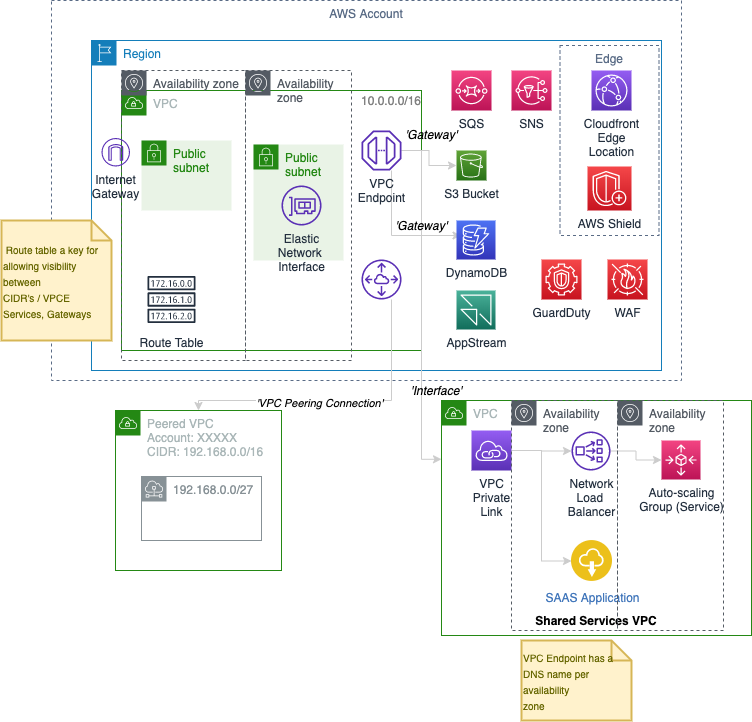

# AWS Advanced Networking Exam


* Design and implement AWS networks (29%)
* Hybrid IT network archs (23%)
* Configure network integration with application services (15%)
* Design and implement for security and compliance (12%)
* Automate AWS tasks (8%)
* Manage, optimise and troubleshoot the network (12%)

## Chapter 1 - Introduction to Advanced Networking

Regions, Availability Zones, edge locations, and customer cross-connect facilities

When you use services that are delivered directly on the Internet, such as edge locations and public service endpoints, you control network behaviors using service-specific mechanisms like policies and whitelists

### How Packet exchange works in a VPC

When an Amazon EC2 instance, say Instance A, in your VPC initiates communication with another Amazon EC2 instance, say Instance B, over IPv4, Instance A will broadcast an Address Resolution Protocol (ARP) packet to obtain the Instance B’s Media Access Control (MAC) address. The ARP packet leaving Instance A is intercepted by the server Hypervisor. The Hypervisor queries the mapping service to identify whether Instance B exists in the VPC and, if so, obtains its MAC address. The Hypervisor returns a synthetic ARP response to Instance A containing Instance B’s MAC address.

Instance A is now ready to send an IP packet to Instance B. The IP packet has Instance A’s source IP and Instance B’s destination IP. The IP packet is encapsulated in an Ethernet header with Instance A’s MAC as the source address and Instance B’s MAC as the destination address. The Ethernet packet is then transmitted from Instance A’s network interface.

### Direct Connect

Using industry standard 802.1q VLANs

This dedicated connection can be partitioned into multiple virtual interfaces. This allows you to use the same connection to access public resources such as objects stored in Amazon S3 using public IP address space, and private resources such as Amazon EC2 instances running within an Amazon Virtual Private Cloud (VPC) using a private IP space, while maintaining network separation between the public and private environments.

All data transferred over your dedicated connection is charged at the reduced AWS Direct Connect data transfer rate rather than Internet data transfer rates.

Provides 1 Gbps and 10 Gbps connections



## What runs in an Edge location?

 * Amazon Cloudfront with Amazon S3
 * AWS Lambda@Edge
 * Route53
 * Web firewall
 * Shield (Anti-DDOS)

116 Edge locations, Regional Edge caches

**Why?**
 * Improved latency, less packet loss & overall quality
 * Avoids conflict with network interconnect capacity
 * Greater Ops control

### Goals

 * Global Infrastructure, Regions, AZ's
 * Amazon VPC
 * How Cloud Service Integration works


# Chapter 2 - VPC, Networking fundamentals

A VPC IPv4 address range may be as large as **/16** (65,536 addresses) or as small as **/28** (16 addresses)
CIDR block is required.

Amazon EC2 features like instance metadata and the Amazon DNS Server require the use of IPv4

Private IP addresses are IPv4 addresses assigned from the CIDR block of your VPC

VPC subnets have a modifiable attribute that determines whether elastic network interfaces created in the subnet will automatically receive public IPv4 addresses

Should not overlap

Max of 6 CIDR ranges per VPC

/16 (65536), /28 minimum (16 IP addresses)
32 - '/X' byte count ( ^2)

## IP V6

(Optional) IPv6 address range is a fixed size of /56 (4,722,366,482,869,645,213,696 addresses) and is assigned to your VPC from Amazon’s own IPv6 allocation.
IPv6 addresses are public.

But.. number of IP6 addresses is constrained by pool of available IP4 addresses in the VPC.

VPC can operate in dual-stack mode. IPv4 and IPv6 operate independently. You will need to configure the routing and security components of your VPC for each address family

Similar to IPv4, you can configure an attribute on your subnet to assign an IPv6 address automatically to new elastic network interfaces created in a given subnet.

Associate a fixed-size /64 IPv6 CIDR block to each subnet that requires IPv6


### Link Local addresses

LLAs are addresses from the reserved fe80::/10 IPv6 CIDR block. The LLA is a required “on-link” address used for a variety of IPv6 processes, including DHCPv6 and Neighbor Discovery Protocol

Amazon VPC expects the LLA of a given interface to conform with the modified **EUI-64** format in which the **48-bit MAC address of the elastic network interface** is converted into a 64-bit interface ID

### GUA addresses

'Global Unicast Address'

To communicate with the Internet over IPv6, your instance must use an Amazon GUA

Amazon maintains large IPv6 GUA allocations from Regional Internet Registries (RIRs)

## CIDR blocks per subnet

5 reserved IP addresses in a subnet ( .0, .1, .2, .3, .255)

Route table is interpreted by the Router (.1) - expressed as CIDR blocks or VPC Gateway endpoints, or ENI's.

 * .0 Network address (of Subnet?)
 * .1 Router of the subnet itself
 * .2 DNS IP Address for Subnet (DNS Resolver)
 * .3 AWS Reserved
 * .255 Broadcast address (Reserved)

## Elastic IP addresses

Allocation of an Elastic IP address within (specific to) a region

[Amazon IP Ranges per region](https://ip-ranges.amazonaws.com/ip-ranges.json)

Public IP addresses are assigned from a pool of routable IPv4 addresses administered by Amazon

## Security Groups

Up to 500 security groups for each VPC.

You can add up to 50 inbound and 50 outbound rules to each security group

Associate up to five security groups with each network interface.

Allow rules, but not deny rules. Implicit deny

## NACL

Stateless firewall for the subnet
Ordered list of numbered rules on traffic in/out of subnet. Usually it is addition of Deny rules

Not stateful - needs explicit inbound, outbound including ephemeral outbound ports. Return traffic must be explicitly allowed by rules as default is all traffic IN, OUT for NACL's.

Every subnet must be associated with a network ACL

Ephemeral ports:  1025 to 65535
Outbound NACL rule usually allow all 0.0.0.0/0:*

## Internet Gateway

Internet gateway maintains the one-to-one mapping of the instance’s private IPv4 address and public IPv4 address

Amazon EC2 instances within a VPC are aware of their public IPv6 addresses (AWS GUA Allocated). When traffic is sent from the instance to the Internet, the Internet gateway forwards the instance’s source IPv6 address unchanged

**You must do the following to create a public subnet with Internet access:**

```
Create and attach an Internet gateway to your VPC.
Create a route in the associated subnet route table to send non-local traffic (0.0.0.0/0 for IPv4 or ::/0 for IPv6) to the Internet gateway.
Configure your network ACLs and security group rules to allow relevant traffic to flow to and from your instance.
```

**You must do the following to enable an Amazon EC2 instance to send and receive traffic from the Internet:**

``
Assign a public IPv4 or Elastic IP address.
Assign an IPv6 GUA.
``

## NAT Gateways, Instances

NAT gateway provides better availability, provides higher bandwidth, and requires less administrative effort than NAT instances

NAT is not supported for IPv6, To create a private IPv6 subnet, see the section on the egress-only Internet gateway

## Virtual Private Gateways (VGWs), Customer Gateways, and Virtual Private Networks (VPNs)

Connect an existing data center to your VPC using either hardware or software VPN connections. Both options make the VPC an extension of your data center

virtual private gateway (VGW) is a logical construct in your VPC that provides edge routing for AWS managed VPN connections and AWS Direct Connect

Customer gateway represents the physical device or software application on the remote end of the VPN connection. The customer gateway must have a static IPv4 address

Once the VGW and the customer gateway have been created, the last step is to create a VPN connection.

A single VPN connection consists of two Internet Protocol Security (IPsec) tunnels for high availability to the VPC.

VPN Connection can have either static, or dynamic routing (BGP supported)

If you will be using static routing, you must enter the routes for your network that should be communicated to the VGW

## VPC Endpoints

two types of VPC endpoints: interface and gateway

Avoids sharing / throttling of NAT gateway, Internet Gateway (5 GBps)


VPC endpoints are supported for IPv4 traffic only

Interface endpoints (powered by AWS PrivateLink) use an elastic network interface in your VPC with a private IP address that serves as an entry point for traffic destined to a supported service

Interface endpoints support Amazon Kinesis Streams, Elastic Load Balancing API, Amazon EC2 API, Amazon EC2 Systems Manager (SSM), AWS Service Catalog, Endpoint services hosted by other accounts, and supported Marketplace partner services

Gateway endpoints use a route table target for a specified route in your route table for supported services. Gateway endpoints currently support communication with Amazon Simple Storage Service (Amazon S3) and Amazon DynamoDB

Endpoints allow resources in your VPC to use their private IPv4 addresses to communicate with resources outside of their VPC.

### Creating a VPC Endpoint (Gateway)

```
Specify the VPC.
Specify the service. -- com.amazonaws.<region>.<service>.
Specify the policy. You can allow full access or create a custom policy. This policy can be changed at any time.
Specify the route tables. A route will be added to each specified route table, which will state the service prefix list as the destination and the endpoint as the target.
```

Using a VPC endpoint, your Amazon S3 bucket policy can allow access based on a VPC identifier or on a specific VPC endpoint identifier. (Don't use IP address)

`aws:sourceVpce: vpcendpoint_ID`

## VPC Peering

an create a VPC peering connection between your own VPCs or with a VPC in another AWS account
VPC peering is supported in the same region or to another region within the same Amazon partition

Peering connections are created through a request/accept protocol

Once a VPC peer is established, both sides of the peer must add routes for the respective peer.  You can also use partial prefixes in the route table for peering (when whole range is not needed )

If a peer is established within the same region, you can reference security groups in the peer VPC, enable DNS hostname resolution for the peer VPC.

Peers within the same region may enable hostname resolution to receive private IPv4 addresses for peer instances.

Amazon encrypts traffic between peers in different regions.

You cannot have more than one peering connection between the same two VPCs at the same time

For certain applications (for example, web services), it may be more beneficial to use VPC endpoints

Jumbo frames are supported only between peers in the same region.

IPv6 is supported only between peers in the same region

### What is a Partition?

The first element of an ARN is the partition. Partitions allow Amazon to group regions with common, but distinct, operational requirements into isolated administrative domains.

(aws, aws-cn, aws-us-gov)

## Placement groups

logical groupings of instances within a single Availability Zone

low-latency, high packet-per-second performance, and high network throughput. Placement groups are appropriate for workloads like High Performance Computing (HPC) when internode network performance is important. (Use instances with enhanced networking)

a placement group causes instances to colocate in a section of the Amazon infrastructure. Recommended you explicitly set number of instances required.

 * Confined to single AZ
 * Slowest instance is determinant of network throughput
 * Network traffic outside placement group, is 25Gbps for EC2, S3 & 5Gbps for other traffic
 * Support both IPv4, IPv6

 ## Elastic Network Interfaces

 Virtual network interface you can attach to an instance in a VPC, only available within a VPC and are associted with a subnet upon creation.

 Has a primary IPv4 private address, mac address and at least one security group. You cannot detach the primary network interface.

 An elastic network interface is confined to a single Availability Zone

 It can also have a secondary private IP, one or more Elastic IP addresses, one public IPv4 address and one or more IPv6 addresses.

 An ENI Can attach to a replacement EC2 Instance, and more than 1 ENI can be attached to an EC2 instance.

Multiple elastic network interfaces allow you to use network and security appliances in your VPC, create dual-homed instances with workloads/roles on distinct subnets, or create a low-budget, high-availability solution.

The maximum number of elastic network interfaces per instance and the number of IPv4 or IPv6 addresses supported on the elastic network interface vary based on the Amazon EC2 instance type.

Elastic network interfaces can be attached to an instance while running (hot attach), when stopped (warm attach), or at launch (cold attach)

ENI used to communicate to EBS (Elastic block store)

## DHCP Option sets

A standard for passing configuration information to hosts on an IP network.

The Domain Name Service provides a standard mechanism to resolve a hostname to an IP address. Amazon VPC attribute `enableDnsSupport` determines whether or not the Amazon DNS server is enabled for your VPC

Amazon DNS integrates with Amazon Route 53 and AWS Directory Service. When two VPCs within the same region are peered, you can enable DNS resolution for Amazon EC2 instances across the peering

Each VPC must have exactly one DHCP option set assigned to it.

Parameters:
 * Domain Name Servers (DNS)
 * Domain name
 * NTP-Servers
 * netbios name Servers
 * netbios node type


## VPC Flow Logs

Feature of Amazon VPC that captures IP traffic flow information in your VPC

VPC Flow Logs can be enabled at the VPC, subnet, or network interface level. The logs are published approximately every 10 minutes - useful for a number of reasons, including anomaly detection and troubleshooting

## 'JumboFrames'

Standard - 1522 bytes (Overhead for 'envelope' is higher)

Jumbo Frames 9001 MTU - smaller overhead, but.. all devices must support the 9001 MTU ( Internet)
Within a VPC
Not well supported outside a VPC, VPN, Internet

# Chapter 3 - Advanced Amazon Virtual Private Cloud

## VPC Endpoints

A VPC endpoint lets you privately connect your VPC to an AWS Cloud service without requiring an Internet gateway, a Network Address Translation (NAT) device, a VPN connection, or AWS Direct Connect.

VPC endpoints allow access to public AWS APIs without requiring access to the Internet, also allow you to define granular access control to services between VPCs or accounts without allowing the broad access provided by VPC peering.

It is possible to limit Amazon S3 bucket access to specific VPC endpoints, which can be configured for specific subnets and instances through routing and security groups.

Also possible to reduce or eliminate the need for an AWS Direct Connect public Virtual Interface (VIF) if all of the AWS Cloud services that you need to access are available through VPC endpoints.

VPC endpoints may support a VPC endpoint policy (Default policy)

### Gateway VPC endpoints

DynamoDB, S3

Instances using gateway VPC endpoints will resolve the service’s Domain Name System (DNS) to a public address.

The route to those public addresses uses the gateway VPC endpoint to access the service.

Gateway routes are added to appropriate route tables for subnet to allow those subnets to route to the VPC Gateway endpoints:

You can create multiple VPC endpoints in the same VPC. This is used to apply different endpoint policies to allow different access.

Amazon DynamoDB support endpoint policies. An endpoint policy can restrict access to operations such as writes or access to specific tables.

Amazon S3 endpoint uses DNS to direct traffic to the endpoint. You must enable DNS resolution in your VPC.

### Interface VPC endpoints

Special elastic network interfaces in Amazon VPC. When you create an interface VPC endpoint, AWS generates endpoint network interfaces in the subnets that you specify.

Interface VPC endpoints appear as an elastic network interface in your VPC

 Interface VPC endpoints also support connectivity over AWS Direct Connect, enabling applications outside AWS to access AWS Cloud services via the Amazon private network

### AWS Private link

AWS PrivateLink enables you to securely pass data directly to a SaaS application without ever leaving the AWS Network.


Example apps you can buy / configure as VPC Intefaces:

DynaTrace, Cisco Stealthwatch

### limitations

Gateway VPC endpoints use AWS route table entries and DNS to route traffic privately to AWS Cloud services

Connections that originate from Amazon VPN or AWS Direct Connect through a Virtual Private Gateway (VGW) cannot directly access gateway endpoints. You also cannot access a gateway endpoint over VPC peering

### Securing Gateway VPC endpoints

VPC endpoint policies can limit what resources, such as buckets or tables, are accessible using the endpoint. Endpoints are the whole service by default.

Inside the VPC, you can control endpoint access by limiting the subnets with routes to the VPC endpoint. (e.g. Private Subnets only)


## VPC Endpoint Services

You may also want to access your own or someone else’s services privately rather than over the internet.

A VPC endpoint service is an interface VPC endpoint that you control and that keeps traffic within Amazon’s private network

VPC endpoint service functionality is useful for connecting applications across VPCs

VPC endpoints offers greater scale and address flexibility than VPC peering

## Transitive Routing

Transitive routing affects traffic that arrives or leaves via an Internet gateway, NAT Gateway, VPC peering, gateway VPC endpoint, DNS services, AWS Direct Connect, or AWS VPN.

If the source of a packet is not an interface in the local VPC, the destination of the connection must be the IP address of a network interface local to the VPC.

The destination or source of the packet must be an interface local to the VPC or the traffic will be dropped.

Exception of the VPN Gateway (VGW) which will re- advertise any routes it receives over VPN or AWS Direct Connect to all other peers (CloudHub)

Proxies, routers, Amazon EC2 VPN, and NAT instances can enable more flexible connectivity to and from external networks

When these devices receive a packet and forward it to the next hop, the retransmitted packet will then have a source of the Amazon EC2 instance instead of the external network. This behaviour requires disabling the source/destination check (this is on the ENI).

 * Can use a DNS proxy to access gateway VPC endpoints over AWS Direct Connect or VPN
 * In a Peered VPC scenario - 1 has an IG, one doesn't - using an Internet proxy in the Internet-connected VPC can resolve the transitive routing problem
 * If there are defined private hosted zones with Amazon Route 53 in your VPC, those DNS names are only accessible via the local VPC by default - use DNS Proxies or solutions in these cases
 


## Add IPv4 CIDR ranges to a VPC

RFC1918 addresses when possible

```
0.0.0.0        -   10.255.255.255  (10/8 prefix)
172.16.0.0      -   172.31.255.255  (172.16/12 prefix)
192.168.0.0     -   192.168.255.255 (192.168/16 prefix)
```

The resize VPC feature allows you to add up to five additional IPv4 CIDR ranges to your VPC

New VPC CIDR ranges cannot overlap with the existing CIDR range or the CIDR range of any current VPC peer

You can effectively create ranges up to a /14 (262K) or /15 using individual /16 (65k) ranges.

## Cross-Account Network interfaces

Grants an AWS-authorized provider account permission to attach a customer network interface to an instance in the provider account

The cross-account network interface does not provide high availability or fault tolerance

effectively move the instance out of the VPC while maintaining a network interface for communication. In summary, a cross-account network interface is a useful feature if you are interacting with a low level of abstraction.
