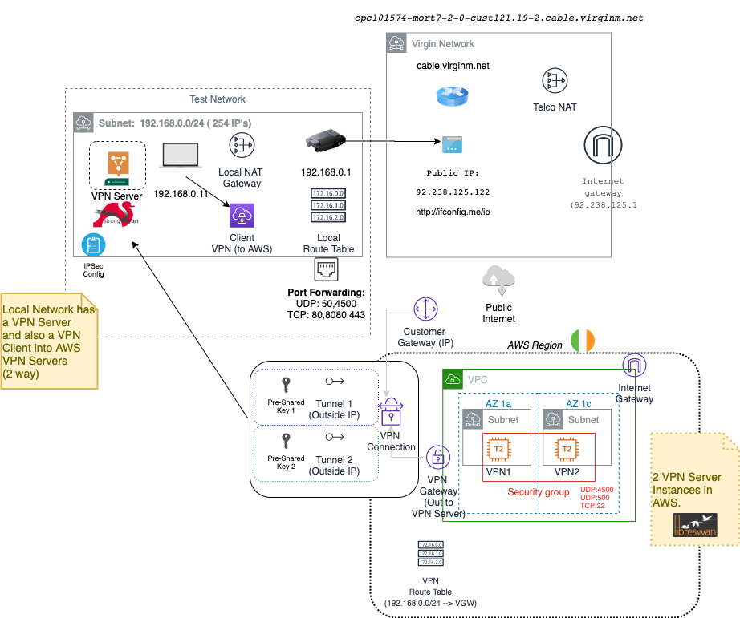

# Ansible - create a Hybrid AWS, On Prem Architecture

This role was to support the learning required in the [AWS Speciality Certification advanced networking.](https://aws.amazon.com/certification/certified-advanced-networking-specialty/)

## How our Local and Telco network look

There is only one Public IP address for all local devices behind our Home Router.

The Telco network is a black box - there could be many, changing routes and subnets before a packet reaches the public internet. Routing is controlled at a lower Network stack level typically using the BGP protocol.

To enable a VPN IPSec connection to be reached ports are opened on the local Router device through the Admin console.



[RFC-1918 CIDR Address Allocation Ranges for Private Internets](https://tools.ietf.org/html/rfc1918)

```
10.0.0.0        -   10.255.255.255  (10/8 prefix)
172.16.0.0      -   172.31.255.255  (172.16/12 prefix)
192.168.0.0     -   192.168.255.255 (192.168/16 prefix)
```

# Pre-Requisites

VPC for dev.neilpiper.me created

Using playbook `./infra/infra.yml`


# VPN Types

## Type 1 - Site to Site VPN

You can enable access to your remote network from your VPC by creating an AWS Site-to-Site VPN (Site-to-Site VPN) connection, and configuring routing to pass traffic through the connection.

IPv6 traffic is not supported

[AWS: What is AWS Site-to-Site VPN?](https://docs.aws.amazon.com/vpn/latest/s2svpn/VPC_VPN.html)

```
VPC Public Subnet:  1a 10.0.0.0/28    1c 10.0.3.0/28

Via Internet Gateway

On-Prem: 192.168.0.0/24 (Via: 92.238.125.122)

```

# Software vPN

## Docker IPSec VPN Server on EC2 (HA)

I created an Amazon AMI based on the Docker project below.
It is Libreswan VPN running on Debian GNU Linux 9

```
AMI: ami-07cd0d3b7336a9564
```

[Github: /hwdsl2/docker-ipsec-vpn-server](https://github.com/hwdsl2/docker-ipsec-vpn-server)


[AWS Marketplace - Debian GNU Linux 9](https://aws.amazon.com/marketplace/pp/B073HW9SP3?ref_=aws-mp-console-subscription-detail)

[Medium: How to create a Free personal VPN in the cloud](https://medium.com/@tatianaensslin/how-to-create-a-free-personal-vpn-in-the-cloud-using-ec2-openvpn-626c40e96dab)

## Installation - ansible

The VPC `dev.neilpiper.me` is required to be setup using playbook `./infra/infra.yml`

```
ansible-playbook -vvv -i ../../../testing install-vpn.yml
```


## Connect to VPN

[Github: /hwdsl2/docker-ipsec-vpn-server VPN Client Setup Instructions](https://github.com/hwdsl2/setup-ipsec-vpn/blob/master/docs/clients.md)


```
PSK: ##REPLACE_ME##
Pass: vpnpass
User: vpnuser
```

## Check VPN server status

```
ssh -i ./aws.vpn.dev.neilpiper.me.pem admin@ec2-ipaddress
sudo -s
ipsec status
ipsec whack --trafficstatus
```


## Steps

### Create Key for SSH

Create a new key called `vpn_keypair` used for SSH into the EC2 VPN instances.

### Create a Pre-Shared Key

Create a 128 character random string (password generation).

In Ansible we will use the password generation technique to generate a 32 character Ascii Alpha-numeric string.

```
vars:
  pwd_alias: "{{ lookup('password', '/dev/null length=32 chars=ascii_letters,digits') }}"
```

### Capture the IP Address

The local IP address is found using `http://ifconfig.me/ip`


### Create 2 VPN Servers

EC2 Instances of Libreswan created in Zone 1a, 1c.

This is to host a VPN server in AWS and not required for an AWS to Client VPN connection.

At this point it is possible to VPN into AWS from the local network.

### Create an AWS Virtual Private Gateway

VPN uses a Virtual Private Gateway similar to a VPC level Internet Gateway or Egress gateway.

###  Create an AWS Customer Gateway (IP Address)

Using the local IP public internet address register a Customer Gateway with that detail.

### Create a VPN Connection between Virtual Private Gateway and Customer Gateway(s)

In our instance we will create a static route version of this with 2 tunnels.

Each tunnel has an IP address created for configuration.


### Create VPN Security Group

## Type 2 - Client to Site vpn

https://docs.aws.amazon.com/vpn/latest/clientvpn-user/user-getting-started.html

Client VPN:
https://docs.aws.amazon.com/vpn/latest/clientvpn-user/macos.html


## Type 3 - VPN hosted in AWS

https://medium.com/@tatianaensslin/how-to-create-a-free-personal-vpn-in-the-cloud-using-ec2-openvpn-626c40e96dab

Create an EC2 Image (OpenVPN)
50Gb Storage (EBS)

Pre-created security Group or:
TCP : 22
TCP: 943
TCP: 443
UDP: 1194

Source:  0.0.0.0/0

ElasticIP - to route to a proper

Route53 to route to the ElasticIP address

https://openvpn.net/vpn-server-resources/amazon-web-services-ec2-byol-appliance-quick-start-guide/
OpenVPN EC2 AMI ID:  ami-0cb4952aadb21a730

# References

## How to create Pre-Shared Keys for IPSEC

https://support.zpesystems.com/portal/kb/articles/how-to-create-pre-shared-keys-for-ipsec

## Docker Client

OpenVPN: https://hub.docker.com/r/dperson/openvpn-client

docker-ipsec-vpn-server - IPSEC setting up clients
https://github.com/hwdsl2/setup-ipsec-vpn/blob/master/docs/clients.md

## Docker IPSec Server

Configuration at `./tasks/vpn.env`

https://github.com/hwdsl2/docker-ipsec-vpn-server

https://libreswan.org/man/ipsec.conf.5.html

Inspecting & logs:

`docker logs ipsec-vpn-server`
`docker inspect containerID`


# BGP (Border Gateway Protocol)


How to manipulate best path network routing algorithms - decentralised.
BGP Operates over TCP

'Peers' - no auto-discovery (AS's - Autonomous system - number)
Mutually configured and agreed (Both ends mirror)
A 'Path vector protocol' - Administrators can influence selections - only best path info, not all paths

EBGP - external bgp
IBGP - internal BGP - same autonomous systems

Useful for a distributed business , across states, countries

'Weights' - Highest best
Weight is not always supported - can be vendor specific
Local preference another way to influence
AS Path length (e.g  101,100,103 vs. 103) - Lowest best
AS Path length can be manipulated (e.g. 10.1.0.1 = 101,101,101,i  vs. 103,101,i )

A router knows about routes, advertises to Peers

### BGP - 'Multi Exit Discriminator (MED)'

.1 Defaults to the router e.g. 192.168.1.1

Priority for best path:

Most specific wins
First valid path == current best path
Weight (Outbound traffic) = Local to router & vendor specific (e.g. may be CISCO only) - Highest wins
LOCAL_PREF - Allows preference between routes - Defaults to 100, Highest wins
LOCAL ORIGINGATION - learned locally, from another IGP
AS_PATH = shortest AS Path that exists  - shortest path wins, (can be artifically adjusted but will be 'public')
ORIGIN CODE = IGP, EGP, ?(Incomplete)
MED = Metric attribute, to choose between >1 connections between 2 nodes - Lowest '0' is preferred


Cisco logic:
https://www.cisco.com/c/en/us/support/docs/ip/border-gateway-protocol-bgp/13753-25.html

# VPC routing

VPC has HA, multiple - present in every subnets
Using the reserved IP addresses per subnet (5)
 * Subnets (.0)
 * Router (.1)
 * DNS (.2)
 * AWS Reserved (.3)

DHCP Option set - Service for Whole VPC

VPCs can be between /16 and /28 - using anything in the 10.0.0.0/8, 172.16.0.0/12 and 192.168.0.0/16 ranges. Further information:


VPC Subnet IP6/IP4 CIDR Ranges
https://docs.aws.amazon.com/vpc/latest/userguide/VPC_Subnets.html#VPC_Sizing

https://kthx.at/subnetmask/

## ENI's

ENI's can be moved within in AZ to other instances - AZ concept
An ENI is auto-created on instance creation
Security groups are attached to ENI's  (Enforced at this level)

ENI's can be added via API, CLI after creation

Use cases:
* MAC address based licensing - allows ENI's to move between Primary, backup
* Fine grained security groups based on network interface 'cards' (Like the Monitor, Admin, Manage)
*

https://docs.aws.amazon.com/AWSEC2/latest/UserGuide/using-eni.html


# NAT's

Gateways vs. instances

NAT instances can be Bastion hosts - not possible for Gateways
NAT Gateway - No port forwarding, No traffic metrics (Yet)
NAT Gateways - can't associate security groups
NAT Instances can have Security Groups
NACL's can be associated to Public subnets (IP CIDR ranges)
NAT Instance terminates
NAT Instance not as scalable, need outages, HA architecture

## Virtual Private Gateways

## Subnet Types

 * VPC only
 * Private Subnet
 * Public Subnets - route to Internet Gateway, Public IP addresses
 * Hybrid Subnets
 * VPN Only Subnet (Data Centre extension) - No public subnet links
 * VPN Egress?  - Internet out only, allow VPN In/Out

Could add VPC Peers

## VPC Peering

Different ways to segment

VPC's are isolated
VPC associated to an account

Significant benefits over VPN peering

Sometimes there is account separation
Prod account
Dev/Test account

for VPC peering, a key one is that they not have overlapping CIDR ranges.
Inter-Region VPC peering is permitted with limitations.
Further information: https://aws.amazon.com/about-aws/whats-new/2017/11/announcing-support-for-inter-region-vpc-peering/https://docs.aws.amazon.com/AmazonVPC/latest/PeeringGuide/Welcome.htmlhttp://www.subnet-calculator.com/cidr.php


# VPC Endpoints

Endpoints are region scoped
Endpoints aren't extended across VPC boundaries
DNS resolution is needed within the VPC
Default VPCE Policy is unrestricted - can be locked Down (VPCE Policy + Bucket Policy)
Security groups - can use VPCE's
Can't use NACL's easily
Can have >1 VPCE in a VPC for the same service (Routing table to prioritise / switch which is used)
VPC Gateway Endpoints are only accessible by entities inside the VPC, e.g. EC2.. VPC Interface Endpoints can be accessed beyond the VPC by connecting to their IP Address within the VPC


# HYBRID NETWORKS

Why VPNVP?
Why not big bang?
Why transition?
What flavours of Hybrid?
What controls?
What security / Firewall controls?
What reasons?

### Reactive Justifications:

Speed important
Possibly a compliance type issue, mission critical
Often: 'Data centre extension'
Capacity / Cost could also be a driver, end of contract/life of a DC
Finding from an audit - no H/A
Forced out of a DC / Damage / Cost
Security / Data breaches - Special regulations (GPDR,HIPAA, PCI, GOV.UK, ..)

### Pro-Active Justifications:
More strategic
Possibly prototypes
Again can be DC extension - look at types of services that are important
HA/DR expansion - reduce using a hot standy DR / Data Centre

# VPC VPN

Hardware optimised as a vPN appliance
Highly available - Multi AZ
Can use dual tunnel architecture & Dual customer Gateway
API/Client

Can't be used to APC VPC's
Tunnels time out - may need a keep alive process
Inconsitent network latency (over internet unless using direct connect)


# Hardware vPN
VPC VPN's
One per VPC (Like an Internet Gateway)
Per hour connection charge
Data charge
Dynamic routing preferred over static
BGP supported
IP Sec, statically public IP addresses

## Dynamic Hardware VPN's

64512 and above ASN is for private BGP (ASN) Routing
7224 - is ANS number for all AWS VPN (ASN number)

Enable route propogation on VPN Subnet route tables
Set local preference >100 to bias a particular path (Default of 100) - Outbound Routing
Routing decision tree is a big part of exam marks

Outside the VPC, only 1500 L3 MTU and 1522 Layer 2 MTU are supported (Jumbo Frames)

# Cloud Hub architecture

MPLS Telco Network (Managed virtual network - 'mesh' network in a resilient way)

AWS - offers CloudHub - Mesh networking

AWS VPC using a BGP - VPN Gateway for routing (propogation) to multiple Network Sites
AWS supports direct connect for this design pattern as well
Direct connect can use VPN as a backup too.

IPSEC + BGP are key requirements for your routers


# Direct connect

Connect to all your AWS resources in an AWS Region, transfer your business critical data directly from your datacenter, office, or colocation environment into and from AWS, bypassing your Internet service provider

Uses a DX location and DX router
Co-location or Customer router
Often a Partner
Physical - slow to set up, physical cabling - can fail
Can be combined with hardware VPN's
Much more expensive than Hardware / Software VPN's
Economical traffic
Consistent network latency, higher Speed - can be split across multipe VPCs, accounts

Usually needs a colacted AWS
2 DX routers per Direct Connect location
Co-location facility (AWS Cage: DX Router --- Customer/Partner Cage: Cust/Partner router)
There may be a 3rd

There is a high speed AWS Backbone to all DX (Direct connect) locations
802.12 TRUNK (Multiple VLANS)
LOA (Letter of Authority)
X-Connect 802.12 TRUNK

AWS account
DX Connection (for AWS Account)  : DX Conn ID (1Gig ro 10 Gig, Port number on DX router 802.12 Trunk)
DX location
Cust/Partner

Setup:  Cross connect between Port and customer router within CoLo facility or DX locations
 - single mode fibre 1000 base LX, or 10 Gig base LR

Once DX is physically terminated
Optional: Onward delivery to premises or network

Physical process (Longer - harder to change / roll back)
Customer , AWS, DX Loation provider ... & Connection Partner

Region?
DX Loction choice (Speed + Location) & Connection Name
(Wait - AWS request)
AWS - arrange port on DX Router ( up to 3 days) + LOA Document to root user
(You or Carrier/Partner) Arrange cross connect to DX location
Optional: Physical backhaul from carrier to customer (Up to 90 days) - depends on conditions at DX location
Port configuration & physical integration
Interface creation, configuration, integration ()

Low latency, consistently Low
Higher throughput than VPN's - physical
Multiple types of traffic - can create as many VLAN's
Reduced cost vs. internet traffic
Economic per hour costs
pay only for the network ports you use and the data you transfer out of the AWS Region over the AWS Direct Connect connection, which can greatly reduce your networking costs

Direct connect has Public and Private Virtual Interfaces
Public: e.g. S3, DynamoDB (Separate VLAN) - Cheaper & Faster than using internet
Public:  Need router peer IP, Amazon router peer IP and a public ASN
VIF's have configuration downloadable
32Gigs per hour

public VIF over a Direct Connect
Public ASNs can be used, public peer IP addressing must be used.

## Securing DirectConnect


## Sub 1Gbps with a Partner

'Network extension'

## Virtual Interfaces

connection
Owner
VLAN ID

Different to Hosted virtual Interface

# Placement Groups

Spread Placement Groups
Cluster placement Groups
What impacts them - rules e.g. must start, types of Instances

To ensure effective operation of placement groups, instances should ideally be of the same size AND started at the same time. Further information:

Cluster Placement Groups are limited to certain instance types. Spread Placement Groups do not have this limitation

A placement group can span VPCs.
A placement group can span AZ's if the option is selected on creation.

https://docs.aws.amazon.com/AWSEC2/latest/UserGuide/placement-groups.html

# DHCP Options
What is in a DHCP Option set?
Domain Name Servers, Domain Name, NTP Servers, Netbios Servers, Netbios Node type
A DHCP option set can assign ANY DNS servers
Many DHCP option sets can exist, but only one is assigned to a VPC at a time.


# DNS

Sharing DNS between VPC & On Prem
DNS operates over UDP and TCP 53

# Elastic load balancer

An ELB needs a /27 minimum and at 8 free IPs
https://docs.aws.amazon.com/elasticloadbalancing/latest/classic/elb-backend-instances.html
https://docs.aws.amazon.com/elasticloadbalancing/latest/classic/using-elb-listenerconfig-quickref.html

# Route 53, DNS
