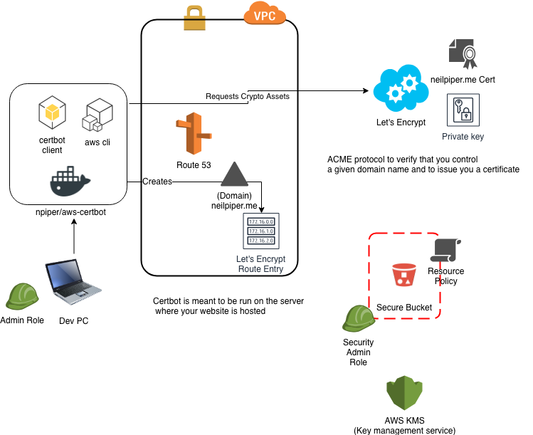
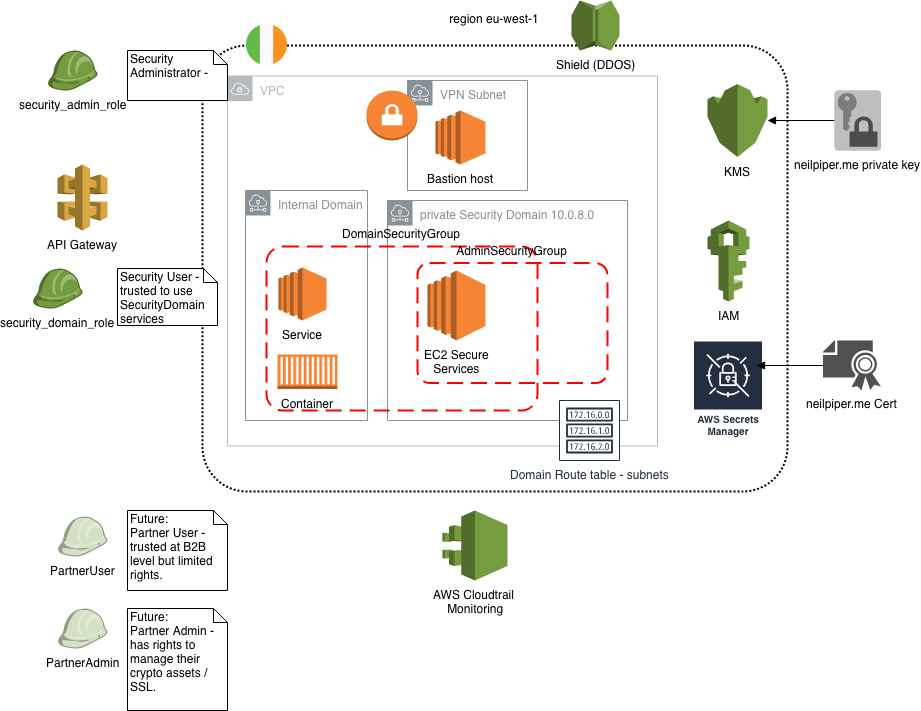

# SECURITY DOMAIN

## Pre-Requisites

Run the playbook in the `infra` role / playbook to create required VPC's and initial subnets.

This playbook will attempt to lookup matching resources based on tags created in that playbook.

## RUNNING

### Check syntax

Perform a syntax check on the playbook, but do not execute it
```
ansible-playbook --syntax-check ../testing security.yml
```

### Dry run
don't make any changes; instead, try to predict some of the changes that may occur

```
ansible-playbook --check -i ../testing security.yml
```


### Run in verbose Mode
```
ansible-playbook -vvv -i ../testing security.yml
```

# Services

 * Certificate issuance & management
 * Cryptographic assets & services
 * Identity and access management
 * Key / Token management
 * Secret management
 * Security monitoring & intrusion detection
 * Transaction signingls

## Key management

https://docs.aws.amazon.com/kms/latest/developerguide/overview.html

```
Create, describe, and list master keys

Enable and disable master keys

Create and view grants and access control policies for your master keys

Enable and disable automatic rotation of the cryptographic material in a master key

Import cryptographic material into an AWS KMS master key

Tag your master keys for easier identification, categorizing, and tracking

Create, delete, list, and update aliases, which are friendly names associated with your master keys

Delete master keys to complete the key lifecycle

With AWS KMS you can also perform the following cryptographic functions using master keys:

Encrypt, decrypt, and re-encrypt data

Generate data encryption keys that you can export from the service in plaintext or encrypted under a master key that doesn't leave the service

Generate random numbers suitable for cryptographic applications
```

## Security domain networking

Private subnet - initially no internet exposure

Bastion host access only / VPN

Security Groups / Roles:
Internal Domain to Security Domain (SG)

Grants to access role:

Monitoring / detection
MFA / Auth tokens

# Scenarios

 * Create neilpiper.me certificate root
 * Create security.neilpiper.me domain cert chain
 * Install Key/Secret server
 * Store Keys / Secrets in server
 * Establish VPN
 * Build a web server that serves HTTPS based on these assets
 * v1 Certificate / Key services to 1st Domain Role

## Domain & Certificates

Domain: `neilpiper.me`

Certificate:   Let's encrypt



### Getting a certificate for the domain

Let’s Encrypt uses the ACME protocol to verify that you control a given domain name and to issue you a certificate. To get a Let’s Encrypt certificate, you’ll need to choose a piece of ACME client software to use.

Certbot is meant to be run on the server where your website is hosted.

The objective of Let’s Encrypt and the ACME protocol is to make it possible to set up an HTTPS server and have it automatically obtain a browser-trusted certificate, without any human intervention.

First, the agent proves to the CA that the web server controls a domain. Then, the agent can request, renew, and revoke certificates for that domain.

Let’s Encrypt identifies the server administrator by public key. The first time the agent software interacts with Let’s Encrypt, it generates a new key pair and proves to the Let’s Encrypt CA that the server controls one or more domains

## Docker image to create certificates

Created a docker image to execute this from Command line.

https://github.com/npiper/aws-certbot

## idam

keycloak

IDAM outside of AWS

http://www.keycloak.org/about.html

https://hub.docker.com/r/jboss/keycloak/  

Cloudflare

# Network overview



# Certificate management
https://github.com/cloudflare/certmgr (Expiry)


https://github.com/cloudflare/cfssl ( SSL Signing etc;)

CFSSL is CloudFlare's PKI/TLS swiss army knife. It is both a command line tool and an HTTP API server for signing, verifying, and bundling TLS certificates

# Key and secret management.

Vault
https://www.vaultproject.io/

https://learn.hashicorp.com/vault/getting-started/install

Install launch vault
Start server (Dev?)
Storage - Encrypted EBS
Backup in encrypted S3

AWS Secrets engine
https://learn.hashicorp.com/vault/getting-started/dynamic-secrets

Systems manager - Parameter storegit
https://docs.aws.amazon.com/systems-manager/latest/userguide/systems-manager-paramstore.html

# Identity Model

## Trusted roles - Outside org

3rdPartySecurityRole (IDAM)


## Trusted roles - Org

Role: DomainSecurity Role

## Internal roles for Sec Domain:

Role: SecurityDomainAdmin
Role: SecurityDomainDev
Role: SecurityDomainBuild


## References

https://ietf-wg-acme.github.io/acme/draft-ietf-acme-acme.html

[Let's encrypt staging](https://letsencrypt.org/docs/staging-environment/)

[Revoking Certificates](https://letsencrypt.org/docs/revoking/)

[S3 Bucket security](https://aws.amazon.com/blogs/security/how-to-use-bucket-policies-and-apply-defense-in-depth-to-help-secure-your-amazon-s3-data/)

[AWS Certificate manager - import cert](https://docs.aws.amazon.com/acm/latest/userguide/import-certificate-api-cli.html)


[AWS blog - TLS Security to your container](https://aws.amazon.com/blogs/compute/maintaining-transport-layer-security-all-the-way-to-your-container-part-2-using-aws-certificate-manager-private-certificate-authority/)

[AWS - VPN](https://docs.aws.amazon.com/vpc/latest/userguide/VPC_Scenario3.html)
